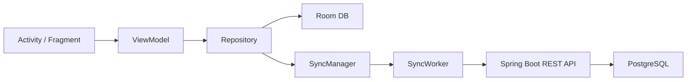

# SMetrix

SMetrix - Android-приложение для ведения строительных проектов, помещений,
смет, материалов и рабочих задач. Проект использует offline-first подход:
изменения сначала сохраняются локально в Room, затем синхронизируются с
Spring Boot сервером через REST API.

## Код для защиты

Начать знакомство с проектом удобнее с короткого маршрута:

1. [`SplashActivity`](app/src/main/java/com/smetrix/app/SplashActivity.java) -
   точка входа и выбор экрана авторизации или основного приложения.
2. [`MainActivity`](app/src/main/java/com/smetrix/app/MainActivity.java) -
   главный контейнер экранов.
3. [`ProjectListViewModel`](app/src/main/java/com/smetrix/app/viewmodel/ProjectListViewModel.java) -
   связь экрана проектов с бизнес-логикой.
4. [`ProjectRepository`](app/src/main/java/com/smetrix/app/repository/ProjectRepository.java) -
   offline-first операции над проектами.
5. [`ProjectEntity`](app/src/main/java/com/smetrix/app/db/entity/ProjectEntity.java) -
   модель проекта в локальной базе.
6. [`ProjectDao`](app/src/main/java/com/smetrix/app/db/dao/ProjectDao.java) -
   SQL-операции Room.
7. [`AppDatabase`](app/src/main/java/com/smetrix/app/db/AppDatabase.java) -
   конфигурация локальной базы данных.
8. [`ApiService`](app/src/main/java/com/smetrix/app/network/ApiService.java) -
   контракт REST API.
9. [`ApiClient`](app/src/main/java/com/smetrix/app/network/ApiClient.java) -
   настройка Retrofit и OkHttp.
10. [`SyncManager`](app/src/main/java/com/smetrix/app/network/sync/SyncManager.java) -
    запуск фоновой синхронизации через WorkManager.
11. [`RoomGeometryCalculator`](app/src/main/java/com/smetrix/app/utils/quantity/RoomGeometryCalculator.java) -
    пример изолированной бизнес-логики расчета помещения.

Подробная шпаргалка по демонстрации кода:
[`docs/SMetrix_defense_code_route.md`](docs/SMetrix_defense_code_route.md).

Полный архитектурный разбор Android-клиента и SMetrix-Server:
[`docs/SMetrix_full_project_review.md`](docs/SMetrix_full_project_review.md).

## Архитектура

## Технологии

- Java и Android XML;
- Android Architecture Components: ViewModel и LiveData;
- Room;
- Retrofit и OkHttp;
- WorkManager;
- Spring Boot, Spring Security и Spring Data JPA;
- PostgreSQL и JWT.

