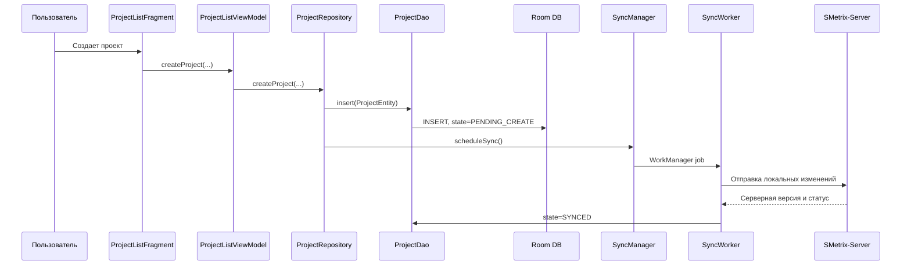
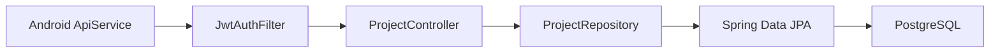

# SMetrix: маршрут по коду для защиты

## 1. Главное решение

Нельзя оставить в GitHub только несколько Java-классов и одновременно
утверждать, что это собираемый полный проект. Java-компилятор проверяет импорты,
Android Gradle Plugin проверяет `AndroidManifest.xml`, ресурсы и generated
binding-классы, Room проверяет Entity и DAO, а Spring Boot сервер зависит от
Controller, Service, Repository, Entity и DTO.

Поэтому правильная схема для защиты:

1. В GitHub хранится весь написанный исходный код, необходимый для сборки.
2. В `README.md` вынесен короткий маршрут по 11 основным Android-классам.
3. На защите сначала открываются короткие и понятные классы.
4. Большие технические классы показываются только как продолжение цепочки.
5. Из репозитория исключаются generated, build, IDE и секретные локальные
   файлы, а не рабочие исходники.

Это уменьшает не проект, а область разговора. Проверяющий сразу видит нормальную
архитектуру, при этом репозиторий остается настоящим и собираемым.

## 2. Какие классы физически обязательны

Для полной текущей версии Android-приложения обязательны все классы, на которые
есть ссылки из исходников:

- Activity и Fragment, объявленные в Manifest или создаваемые навигацией;
- ViewModel и ViewModelFactory;
- Repository;
- Room Entity, DAO, converter и `AppDatabase`;
- Retrofit `ApiService`, DTO, `ApiClient`, interceptor;
- `SyncManager`, `SyncWorker` и sync-модели;
- адаптеры RecyclerView;
- модели и расчетные utility-классы.

Удаление «неинтересного» DTO или DAO тоже ломает сборку, хотя сам файл может
содержать всего 10-30 строк. Поэтому понятия «не показывать первым» и «не
загружать в GitHub» нельзя смешивать.

То же относится к серверу. Для запуска нужны:

- `SMetrixServerApplication`;
- configuration и security-классы;
- используемые Controller;
- Service;
- JPA Entity и Repository;
- request/response DTO;
- exception handler;
- `application.yml` без реальных секретов;
- `pom.xml`.

## 3. Основные Android-классы для демонстрации

Ниже не «единственные нужные файлы», а лучший короткий маршрут по проекту.

| Порядок | Класс | Почему стоит показывать | Сложность |
|---:|---|---|---|
| 1 | `SplashActivity` | Короткая точка входа, понятное ветвление auth/main | низкая |
| 2 | `MainActivity` | Главный контейнер и переходы между экранами | средняя |
| 3 | `ProjectListViewModel` | Наглядный MVVM без самой тяжелой логики комнаты | низкая/средняя |
| 4 | `ProjectRepository` | Показывает offline-first и разделение ответственности | средняя |
| 5 | `ProjectEntity` | Простая модель таблицы Room | низкая |
| 6 | `ProjectDao` | Наглядные Room-аннотации и SQL-запросы | низкая |
| 7 | `AppDatabase` | Связывает Entity, DAO и миграции | средняя |
| 8 | `ApiService` | Весь контракт Android-сервер виден в одном interface | низкая |
| 9 | `ApiClient` | Retrofit, OkHttp и base URL | средняя |
| 10 | `SyncManager` | Простое объяснение WorkManager | средняя |
| 11 | `RoomGeometryCalculator` | Чистая бизнес-логика, которую легко объяснить и тестировать | низкая |

### Классы, которые лучше не открывать первыми

Они важны, но слишком велики для начала разговора:

| Класс | Причина |
|---|---|
| `RoomDetailFragment` | Около 1000 строк UI-логики главного экрана комнаты |
| `RoomDetailViewModel` | Более 800 строк координации данных комнаты |
| `SyncWorker` | Более 1000 строк push/pull синхронизации нескольких типов данных |
| `EstimateRepository` | Более 500 строк расчетов и операций со сметой |
| `RoomRepository` | Более 400 строк геометрии, openings, задач и пересчетов |

Если преподаватель открывает один из них, ответ:

> Это orchestration-класс крупного пользовательского сценария. Его зависимости
> разделены по DAO, Repository, DTO и расчетным utility-классам. Для разбора
> одной законченной цепочки удобнее начать с проекта, потому что там тот же
> архитектурный принцип показан компактнее.

## 4. Цепочка Android, которую надо уметь рассказать

Короткий устный ответ:

> UI не работает с базой и сервером напрямую. Fragment передает действие во
> ViewModel, ViewModel вызывает Repository. Repository валидирует данные,
> создает Entity и сохраняет ее через DAO в Room. Поэтому изменение сразу
> доступно offline. Затем Repository просит SyncManager запланировать
> WorkManager. SyncWorker отправляет ожидающие изменения на сервер и обновляет
> локальный статус после ответа.

## 5. Что говорить по каждому Android-классу

### `SplashActivity`

- Launcher Activity задается в `AndroidManifest.xml`.
- В `onCreate` проверяется активная сессия через `AuthRepository`.
- При активной сессии или guest mode открывается `MainActivity`.
- Иначе открывается `AuthActivity`.
- После выбора следующего экрана Splash закрывается через `finish`.

Вероятный вопрос: почему не показывать форму входа сразу?

Ответ: Splash отделяет проверку состояния сессии от auth UI и не дает
пользователю вручную выбирать стартовый экран.

### `MainActivity`

- Это контейнер основной части приложения.
- Настраивает toolbar и меню.
- Размещает Fragment текущего раздела.
- Показывает состояние синхронизации.
- Реагирует на logout и возвращает пользователя в auth flow.

Вероятный вопрос: почему экраны сделаны Fragment?

Ответ: Activity хранит общую оболочку, а Fragment заменяют содержимое без
создания отдельной Activity для каждого раздела.

### `ProjectListViewModel`

- Переживает пересоздание Fragment при изменении конфигурации.
- Получает `LiveData<List<ProjectEntity>>` из Repository.
- Хранит команды создания, изменения и удаления проекта.
- Не содержит Android View и не знает о RecyclerView.

Вероятный вопрос: зачем ViewModel, если можно вызвать Repository из Fragment?

Ответ: ViewModel отделяет состояние и команды экрана от жизненного цикла View,
упрощает повторное использование и предотвращает потерю данных UI при
пересоздании Fragment.

### `ProjectRepository`

- Получает DAO и `SyncManager`.
- Выполняет операции в фоновом executor.
- Создает UUID и timestamp.
- Сохраняет проект локально со статусом `PENDING_CREATE`.
- Для удаления использует soft delete.
- После локальной записи планирует синхронизацию.

Вероятный вопрос: почему сначала Room, а не сервер?

Ответ: это offline-first. Пользователь не ждет сеть, данные отображаются
немедленно, а доставка на сервер выполняется отдельно и может быть повторена.

### `ProjectEntity`

- `@Entity` описывает таблицу Room.
- `id` создается на клиенте, поэтому запись можно создать без сервера.
- `userId` связывает проект с пользователем.
- `deletedAt` реализует soft delete.
- `version`, `updatedAt`, `lastSyncedAt`, `syncState` нужны синхронизации.
- Денежные коэффициенты представлены `BigDecimal`.

Вероятный вопрос: зачем UUID генерируется клиентом?

Ответ: offline-запись должна получить стабильный идентификатор до обращения к
серверу; тот же id затем используется при синхронизации.

### `ProjectDao`

- `@Dao` сообщает Room, что interface содержит операции базы.
- `@Query` задает выборки и обновления.
- `LiveData` автоматически уведомляет UI об изменении таблицы.
- Pending-запросы выбирают записи, которые еще не доставлены на сервер.
- SQL находится в DAO, а бизнес-решения остаются в Repository.

Вероятный вопрос: кто реализует interface?

Ответ: реализацию генерирует Room во время сборки на основании аннотаций.

### `AppDatabase`

- Наследуется от `RoomDatabase`.
- Перечисляет Entity и текущую версию схемы.
- Выдает DAO через abstract methods.
- Создается как singleton.
- Содержит миграции между версиями схемы.
- Использует converter для `BigDecimal`.

Вероятный вопрос: зачем singleton?

Ответ: приложению нужен один согласованный экземпляр базы и один пул
соединений; многократное создание базы дорого и может привести к конкуренции.

### `ApiService`

- Это Retrofit interface.
- Аннотации `@GET`, `@POST`, `@PUT`, `@DELETE` описывают HTTP-методы.
- `@Body`, `@Path`, `@Query` описывают параметры запроса.
- DTO разделяют JSON-контракт и локальные Room Entity.
- Retrofit генерирует реализацию interface.

Вероятный вопрос: почему нельзя отправлять Entity напрямую?

Ответ: локальная схема и сетевой контракт меняются по разным причинам. DTO не
дают полям Room, sync metadata и внутренним деталям случайно стать частью API.

### `ApiClient`

- Создает singleton Retrofit.
- Берет base URL из `BuildConfig`.
- Подключает Gson converter.
- Настраивает OkHttp и interceptor.
- Возвращает реализацию `ApiService`.

Вероятный вопрос: зачем base URL находится в BuildConfig?

Ответ: адрес сервера зависит от build variant; debug и release могут работать
с разными окружениями без изменения Java-кода.

### `SyncManager`

- Использует WorkManager.
- Создает one-time и periodic work.
- Unique work защищает от бесконтрольного дублирования задач.
- Backoff задает задержку повторной попытки.
- Сам не синхронизирует данные, а только планирует `SyncWorker`.

Вероятный вопрос: почему WorkManager?

Ответ: он предназначен для гарантированной отложенной фоновой работы, учитывает
жизненный цикл процесса и умеет повторять задачу после временной ошибки.

Важно: в текущем коде `buildNetworkConstraints()` фактически создает пустые
constraints. Нельзя говорить, что задача гарантированно запускается только при
`CONNECTED`, пока это не исправлено.

### `RoomGeometryCalculator`

- Не зависит от Activity, Room и Retrofit.
- Получает размеры помещения и openings.
- Считает пол, потолок, стены, объем и периметр.
- Возвращает неизменяемый `GeometryResult`.
- Использует `BigDecimal` для предсказуемой точности.

Вероятный вопрос: почему этот расчет вынесен отдельно?

Ответ: это чистая предметная логика. Ее можно тестировать независимо от Android
и повторно использовать при пересчете сметы.

## 6. Основные классы SMetrix-Server для защиты

Для сервера достаточно вести преподавателя по следующему маршруту:

| Порядок | Класс | Что показывает | Сложность |
|---:|---|---|---|
| 1 | `SMetrixServerApplication` | Spring Boot entrypoint | низкая |
| 2 | `SecurityConfig` | JWT, BCrypt, CORS, защищенные endpoints | средняя |
| 3 | `AuthController` | Регистрация и вход | средняя |
| 4 | `ProjectController` | Обычный CRUD/soft delete | низкая/средняя |
| 5 | `MaterialController` | Поиск материалов по REST API | низкая/средняя |
| 6 | `BatchSyncController` | Прием offline-изменений клиента | высокая |
| 7 | `ProjectRepository` | Spring Data JPA и запросы пользователя | низкая |
| 8 | `Project` | Серверная JPA Entity | низкая |
| 9 | `JwtService` | Создание и проверка токена | средняя |
| 10 | `GlobalExceptionHandler` | Единый JSON ошибок | низкая |

`BatchSyncController` надо уметь объяснить концептуально, но не обязательно
листать целиком. Основную идею синхронизации проще показывать через один тип
данных: `Project`.

## 7. Серверная цепочка

Короткий устный ответ:

> Запрос Android приходит на endpoint `/api/v1`. JWT-фильтр извлекает Bearer
> token, проверяет его и помещает пользователя в SecurityContext. Controller
> получает текущего пользователя, валидирует входные данные и обращается к
> Repository. Spring Data JPA формирует SQL и работает с PostgreSQL. Наружу
> возвращается DTO, а не Entity базы.

## 8. Вопросы по серверу

### Как запускается сервер?

`SMetrixServerApplication.main()` вызывает `SpringApplication.run`. Spring
сканирует компоненты, создает beans, настраивает web server, security, JPA и
подключение к PostgreSQL.

### Где проверяется пароль?

В auth flow пароль сравнивается через BCrypt `PasswordEncoder`. В базе должен
храниться hash, а не исходный пароль.

### Как работает JWT?

После успешного входа сервер выдает access и refresh token. Android добавляет
access token в `Authorization: Bearer ...`. `JwtAuthFilter` проверяет token до
вызова защищенного Controller.

### Как сервер понимает владельца проекта?

Пользователь берется из SecurityContext после JWT-проверки. Запросы Repository
фильтруют данные по owner/user id, а Controller не должен доверять user id,
произвольно присланному клиентом.

### Где хранятся данные?

- На Android: SQLite через Room.
- На сервере: PostgreSQL через Spring Data JPA.
- Токены и session metadata на Android: encrypted preferences.
- Материалы ФГИС на сервере: `material_cache`.

### Как работает offline?

Изменения получают клиентский UUID и локальный sync state. Сначала они
сохраняются в Room. При доступной синхронизации Worker отправляет pending
записи, сервер сохраняет их и возвращает результат. Затем клиент меняет state
на `SYNCED`.

### Что такое конфликт?

Это ситуация, когда локальная и серверная версии одной сущности изменились
независимо. Клиент сохраняет local/server snapshot в `ConflictEntity`, после
чего пользователь может выбрать локальную или серверную версию.

## 9. Что действительно не надо загружать в GitHub

Обычно исключаются:

- `.gradle/`;
- `build/`;
- `app/build/`;
- `.idea/` и локальные IDE-настройки;
- `local.properties`;
- реальные `.env` и пароли;
- crash/replay logs;
- временные screenshots;
- APK, если release-файл не публикуется отдельно;
- файлы с настоящим JWT secret, SMTP password или PostgreSQL password.

Нужно загрузить:

- `app/src/main/java`;
- `app/src/main/res`;
- `AndroidManifest.xml`;
- Gradle build scripts и wrapper;
- Room schema, если она используется для проверки миграций;
- серверный `src/main/java`;
- серверный `src/main/resources/application.yml` с placeholders/env variables;
- `pom.xml`;
- документацию и README;
- тесты.

## 10. Чего нельзя утверждать на защите

1. Нельзя говорить, что сервер не нужен: online-синхронизация, auth и материалы
   используют его.
2. Нельзя говорить, что каждый sync запускается только при наличии сети:
   текущие constraints в `SyncManager` пустые.
3. Нельзя говорить, что FGIS полностью автоматически работает только потому,
   что parser и import-классы существуют. По текущей конфигурации
   `FGIS_ENABLED=false`, а URL templates требуют настройки.
4. Нельзя говорить, что guest mode синхронизируется: он локальный.
5. Нельзя говорить, что Room Entity и API DTO - одно и то же.
6. Нельзя скрывать, что большие orchestration-классы существуют; лучше
   объяснить, почему конкретную архитектурную цепочку показывают на компактном
   примере проекта.

## 11. Готовый рассказ на 90 секунд

> SMetrix состоит из Android-клиента и Spring Boot сервера. После запуска
> SplashActivity проверяет локальную сессию и открывает авторизацию либо
> MainActivity. Основные экраны построены по MVVM: Fragment отвечает за
> отображение, ViewModel хранит состояние экрана, Repository содержит
> бизнес-операции. Данные сначала сохраняются локально в Room через Entity и
> DAO, поэтому приложение продолжает работать offline. Каждая измененная
> запись получает sync state. SyncManager планирует SyncWorker через
> WorkManager, а Worker отправляет pending-изменения на REST API и получает
> серверные обновления. Сеть описана интерфейсом ApiService, Retrofit создает
> его реализацию, OkHttp добавляет JWT. На сервере JWT-фильтр аутентифицирует
> пользователя, Controller принимает DTO, Repository сохраняет JPA Entity в
> PostgreSQL. Таким образом UI, локальная база, сеть и сервер разделены, а
> offline-first синхронизация связывает их в единый процесс.

## 12. Рекомендуемый порядок вкладок перед защитой

Открыть заранее:

1. `README.md`;
2. `AndroidManifest.xml`;
3. `SplashActivity.java`;
4. `ProjectListViewModel.java`;
5. `ProjectRepository.java`;
6. `ProjectEntity.java`;
7. `ProjectDao.java`;
8. `AppDatabase.java`;
9. `ApiService.java`;
10. `SyncManager.java`;
11. `RoomGeometryCalculator.java`;
12. на сервере `SecurityConfig.java`;
13. `ProjectController.java`;
14. серверные `ProjectRepository.java` и `Project.java`.

Главная стратегия: показывать одну законченную цепочку сверху вниз, а не
прыгать между десятками классов.
