# SMetrix и SMetrix-Server: полный технический разбор

Дата разбора: 2026-06-23  
Клиент: `D:\SMetrix`  
Сервер: `D:\Проект SMetrix\SMetrix-Server`

Этот документ описывает не абстрактную идею приложения, а текущую структуру кода: Android-клиент, Spring Boot сервер, локальную базу, сетевой контракт, offline/online режим, синхронизацию, FGIS-импорт, навигацию и основные классы.

## 1. Общая идея проекта

SMetrix - это Android-приложение для строительной сметы. Пользователь создает проект, добавляет помещения, задает размеры комнаты и проемы, подбирает материалы из локального/серверного кэша ФГИС, вводит количество или норму расхода, получает сумму материалов и работ, ведет рабочих и задачи, а затем синхронизирует данные с сервером.

Архитектурная идея проекта:

- Android-клиент работает offline-first: UI читает данные из локальной Room БД, изменения сначала сохраняются локально, потом отправляются на сервер.
- Сервер хранит общую PostgreSQL-базу, принимает batch-синхронизацию, проверяет владельца данных, версии и конфликты.
- Авторизация построена на JWT access/refresh токенах.
- Справочник материалов приходит с сервера из таблицы `material_cache`, которая должна наполняться импортом ФГИС XLSX.
- FGIS импорт на сервере есть как кодовая цепочка, но по текущему `application.yml` автоматический импорт выключен через `fgis.enabled: ${FGIS_ENABLED:false}`.

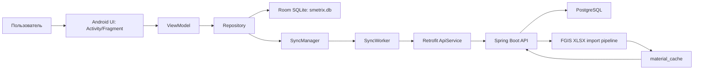

## 2. Репозитории и корневая структура

### 2.1 Android-клиент `D:\SMetrix`

Важные папки и файлы:

| Путь | Назначение |
|---|---|
| `app/src/main/java/com/smetrix/app` | Основной Java-код Android-приложения. |
| `app/src/main/res/layout` | XML-разметки экранов, диалогов, item-строк и bottom sheet. |
| `app/src/main/res/drawable` | Иконки и shape-ресурсы. |
| `app/src/main/res/menu/menu_main.xml` | Верхнее меню `MainActivity`. |
| `app/src/main/res/xml/network_security_config.xml` | Сетевые правила Android, включая HTTP/HTTPS поведение. |
| `app/src/debug/AndroidManifest.xml` | Debug-оверрайды манифеста. |
| `app/src/release/res/xml/network_security_config.xml` | Release-правила сети. |
| `app/schemas/com.smetrix.app.db.AppDatabase` | Экспортированные схемы Room по версиям БД. Это технический артефакт Room, полезен для миграций, но не бизнес-код. |
| `docs/RFC_Part*.md` | Документы с архитектурным замыслом: данные, sync/API, UI/recalc, security/final. |
| `IMPLEMENTATION_PLAN*.md`, `CONTEXT.md`, `phase*.md`, `audit_report.md` | Плановые и отчетные документы проекта. |
| `build.gradle`, `settings.gradle`, `gradle.properties`, `app/build.gradle` | Gradle-конфигурация сборки. |

Что можно не разбирать как бизнес-логику:

- `.gradle`, `build`, `app/build` - временные/сгенерированные файлы сборки.
- `.idea` - настройки IDE.
- `gradle/wrapper/gradle-wrapper.jar` - бинарный wrapper Gradle.
- `hs_err_pid*.log`, `replay_pid*.log` - аварийные логи JVM/процесса.

### 2.2 Сервер `D:\Проект SMetrix\SMetrix-Server`

Важные папки и файлы:

| Путь | Назначение |
|---|---|
| `src/main/java/ru/smetrix` | Основной Java-код Spring Boot. |
| `src/main/resources/application.yml` | Главный конфиг сервера: порт, PostgreSQL, JWT, FGIS, CORS, mail. |
| `src/main/resources/db/migration` | Flyway SQL-миграции для production-схемы. |
| `src/test/java/ru/smetrix` | Тесты безопасности, FGIS, soft delete, UUID converter. |
| `pom.xml` | Maven-конфигурация сервера и зависимости. |
| `.env.example` | Пример переменных окружения. |
| `FGIS_IMPORT.md` | Инструкция/описание импорта ФГИС. |
| `BACKEND_PLAN.md` | План серверной части. |
| `scripts/import-fgis.ps1` | Скрипт ручного импорта XLSX ФГИС. |

Что можно не считать бизнес-кодом:

- `target` - результат Maven-сборки, jar, compiled classes, surefire reports.
- `.idea` - IDE.
- `PROJECT_STRUCTURE2.md` - сгенерированный экспорт структуры.

## 3. Технологии

### 3.1 Android

`app/build.gradle` задает:

- `compileSdk = 35`, `minSdk = 26`, `targetSdk = 35`.
- Java 17.
- `viewBinding = true`.
- Room `2.8.4`.
- Retrofit `3.0.0`.
- OkHttp `5.3.2`.
- WorkManager `2.11.2`.
- Android Security Crypto `1.1.0`.
- Lifecycle LiveData/ViewModel `2.10.0`.
- AppCompat, Material Components, ConstraintLayout.

Текущие product flavors:

- Активен `usb`, где `BuildConfig.API_BASE_URL = "http://127.0.0.1:8080/api/v1/"`.
- `emulator` и `phone` закомментированы.
- В `release` задается `https://api.smetrix.ru/api/v1/`.

Важно: если приложение запускается на реальном телефоне, `127.0.0.1` означает сам телефон, а не компьютер с сервером. Для телефона обычно нужен IP компьютера в локальной сети или USB reverse/tunnel. В проекте раньше был заготовлен `PHONE_SERVER_IP`, но flavor `phone` сейчас закомментирован.

### 3.2 Server

`pom.xml` задает:

- Spring Boot `3.2.5`.
- Java 17.
- Spring Web.
- Spring Data JPA + Hibernate.
- PostgreSQL driver `42.6.2`.
- Flyway.
- Spring Security.
- JWT через `jjwt 0.12.5`.
- Spring Mail.
- Lombok.
- Validation.
- Apache POI `poi-ooxml 5.2.5` для потокового XLSX-парсинга ФГИС.
- Тесты: Spring Boot Test, Spring Security Test, H2.

`application.yml` задает:

- Сервер слушает `0.0.0.0:8080`.
- PostgreSQL: `POSTGRES_URL`, `POSTGRES_USER`, `POSTGRES_PASSWORD`.
- JWT secret и сроки жизни токенов: access 15 минут, refresh 30 дней.
- FGIS по умолчанию выключен: `FGIS_ENABLED=false`.
- FGIS download/session URL template по умолчанию пустые.
- CORS по умолчанию: `http://localhost`.
- В `prod` включается Flyway и `ddl-auto=validate`.

## 4. Android: запуск приложения от старта до главного экрана

### 4.1 Точка входа

В `app/src/main/AndroidManifest.xml` launcher-activity:

- `SplashActivity`
- `exported=true`
- `noHistory=true`

`application android:name=".SMetrixApplication"` означает, что перед любой activity создается `SMetrixApplication`.

### 4.2 `SMetrixApplication`

Класс `SMetrixApplication extends Application`.

Роль:

- Стартует на уровне процесса приложения.
- Инициализирует глобальные вещи.
- По текущей архитектуре именно здесь должен запускаться периодический `SyncManager.schedulePeriodicSync()`, но точную текущую реализацию нужно смотреть в файле при изменениях: в этом разборе основной sync-код находится в `SyncManager`.

### 4.3 `SplashActivity`

Роль:

- Единственная launcher-точка.
- Проверяет, есть ли активная сессия.
- Если пользователь авторизован или включен guest mode - открывает `MainActivity`.
- Если сессии нет - открывает `AuthActivity`.
- Так как `noHistory=true`, Splash не остается в back stack.

Общий поток:

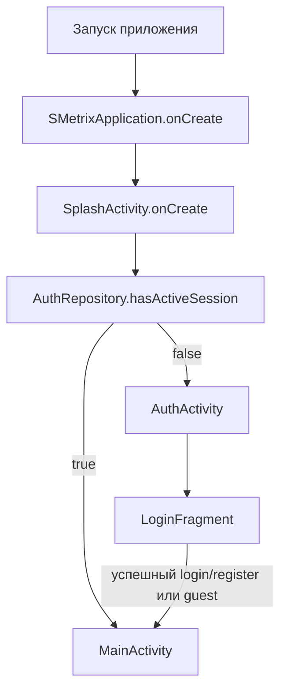

### 4.4 `AuthActivity`

Роль:

- Контейнер для экранов авторизации.
- Вставляет `LoginFragment` в `auth_fragment_container`.
- Обрабатывает кнопку back/up через FragmentManager.

### 4.5 `MainActivity`

Роль:

- Главная Activity после входа.
- Контейнер для основных фрагментов приложения.
- Управляет toolbar/menu.
- Держит `SyncStatusView`.
- Подписывается на `AuthInterceptor.ACTION_LOGOUT` и отправляет пользователя обратно на авторизацию при истекшей/отозванной сессии.
- Имеет метод `showFragment(Fragment fragment, String tag, boolean addToBackStack)` для переходов.

Главный экран по смыслу - `ProjectListFragment`.

## 5. Android: навигация экранов

Навигация реализована вручную через `FragmentTransaction.replace(...)`, без Navigation Component.

Основной маршрут:

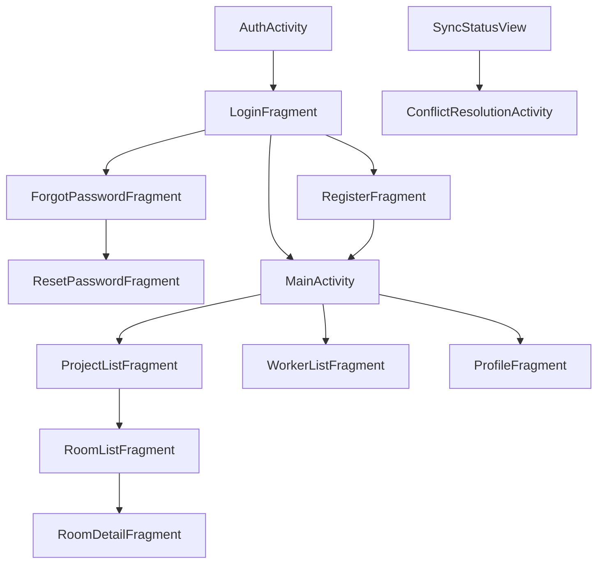

### 5.1 Auth-фрагменты

| Класс | Роль |
|---|---|
| `LoginFragment` | Форма входа. Читает email/password, вызывает `AuthViewModel.login`. Имеет переход на регистрацию, восстановление пароля и guest mode. |
| `RegisterFragment` | Форма регистрации. Вызывает `AuthViewModel.register`; при успехе открывает `MainActivity`. |
| `ForgotPasswordFragment` | Просит email, вызывает `forgotPassword`, затем открывает `ResetPasswordFragment`. |
| `ResetPasswordFragment` | Принимает email/code/newPassword, вызывает `confirmPasswordReset`. |
| `ProfileFragment` | Показывает и редактирует профиль, вызывает `ProfileViewModel`, дает logout. |
| `AuthActivity` | Контейнер этих фрагментов. |

### 5.2 Основные фрагменты

| Класс | Роль |
|---|---|
| `ProjectListFragment` | Список проектов, создание, редактирование, soft delete, переход к комнатам. |
| `RoomListFragment` | Список комнат выбранного проекта, создание/переименование/удаление комнаты, переход к деталям комнаты. |
| `RoomDetailFragment` | Самый насыщенный экран: размеры помещения, элементы/проемы, материалы, смета, работы, totals, поиск материалов. |
| `WorkerListFragment` | Список рабочих, добавление, редактирование, удаление. |
| `ConflictResolutionActivity` | Отдельный экран разрешения конфликтов синхронизации. |
| `SyncStatusView` | Общий виджет статуса синхронизации. |

### 5.3 Bottom sheets и адаптеры

| Класс | Роль |
|---|---|
| `MaterialSearchBottomSheet` | Bottom sheet поиска материалов. Одновременно использует локальный Room-кэш и удаленный поиск через сервер. Имеет ручное добавление материала. |
| `MaterialQuantityBottomSheet` | Bottom sheet для ввода количества выбранного материала. Важен для ручного количества: после выбора материала пользователь вводит количество, а не только получает цену. |
| `ProjectAdapter` | RecyclerView adapter проектов. Показывает sync-dot по `syncState`. |
| `RoomAdapter` | Adapter комнат. |
| `EstimateAdapter` | Adapter позиций сметы. Показывает количество, цену, сумму, статус закупки, поддерживает действия с item. |
| `MaterialSearchAdapter` | Adapter результатов поиска материалов. |
| `WorkerAdapter` | Adapter рабочих. |
| `WorkTaskAdapter` | Adapter работ/задач. |
| `EstimateDiffCallback` | DiffUtil для списка сметы. |

## 6. Android: слои приложения

Android-клиент устроен так:

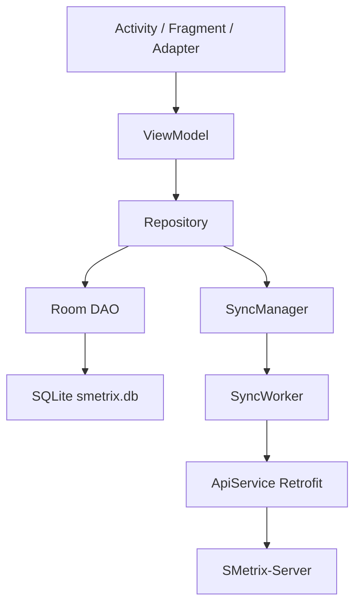

Правило: UI не ходит напрямую в DAO и сеть. UI вызывает ViewModel, ViewModel вызывает Repository, Repository пишет в Room и планирует sync.

## 7. Android: база данных Room

### 7.1 `AppDatabase`

`AppDatabase extends RoomDatabase` - центральная точка Room.

Текущее:

- Имя файла БД: `smetrix.db`.
- Версия схемы: `7`.
- Экспорт схемы включен: `exportSchema = true`.
- TypeConverter: `BigDecimalConverter`.
- Singleton через double-checked locking.
- При открытии БД seed-ит `unit_conversion`.

Таблицы:

- `project`
- `project_room`
- `opening`
- `estimate_item`
- `worker`
- `work_task`
- `materials_cache`
- `unit_conversion`
- `conflict`

Миграции:

| Миграция | Что делает |
|---|---|
| 1 -> 2 | Добавляла `corners_count`, `columns_count`, `ventilation_area` в `project_room`. |
| 2 -> 3 | Добавила `depth`, `placement_type` в `opening`. |
| 3 -> 4 | Пересоздала `project_room`, убрала устаревшие поля геометрии. |
| 4 -> 5 | Изменила `materials_cache`: цена материала стала храниться по паре `fgis_code + region_code`. |
| 5 -> 6 | Добавила `consumption_rate` в `materials_cache`. |
| 6 -> 7 | Добавила расширенные поля расчета в `estimate_item`: `calculation_method`, `waste_percent`, `layers`, `thickness_meters`, `manual_quantity`, `coverage_per_piece`, `coverage_per_package`, `package_size`, `formula_description`. |

### 7.2 Entity-классы клиента

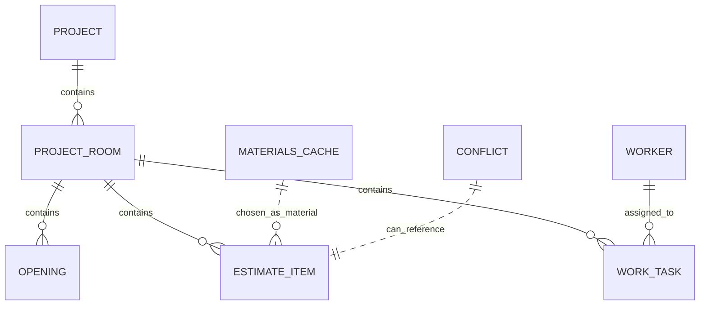

| Entity | Таблица | Главная роль |
|---|---|---|
| `ProjectEntity` | `project` | Проект пользователя: название, город, регион, налоговый коэффициент, логистика, soft delete, sync-поля. |
| `ProjectRoomEntity` | `project_room` | Помещение проекта: длина, ширина, высота, ручная площадь, sync-поля. FK на `project`. |
| `OpeningEntity` | `opening` | Элемент помещения: дверь, окно, вентиляция или колонна. Ширина/высота/depth/placement. FK на `project_room`. |
| `EstimateItemEntity` | `estimate_item` | Позиция сметы: материал, цена, расход, количество, итог, статус, расширенные поля расчета. FK на `project_room`. |
| `WorkerEntity` | `worker` | Рабочий пользователя: ФИО, телефон, специальность, sync-поля. |
| `WorkTaskEntity` | `work_task` | Рабочая задача/оплата: комната, рабочий, вид оплаты, ставка, итоговая выплата. FK на `project_room`, связь с `worker`. |
| `MaterialsCacheEntity` | `materials_cache` | Локальный кэш материалов: код ФГИС, название, единица, регион, цена, расход, источник, популярность. |
| `UnitConversionEntity` | `unit_conversion` | Справочник конвертации единиц ФГИС в единицы приложения. |
| `ConflictEntity` | `conflict` | Локальное хранилище конфликтов синхронизации: тип сущности, локальный JSON, серверный JSON. |

### 7.3 DAO-классы клиента

| DAO | Назначение |
|---|---|
| `ProjectDao` | CRUD проектов, активные проекты по `user_id`, `markDeleted`, `updateAfterSync`, `getByStatesForUser`, upsert из sync. |
| `ProjectRoomDao` | CRUD комнат, комнаты проекта, sync-выборка, получение вложенных estimate/opening/work tasks для пересчета. |
| `OpeningDao` | CRUD элементов помещения, soft delete, sync-state, upsert из pull. |
| `EstimateItemDao` | CRUD сметы, `getByRoomId`, обновление количества/итога, ручное количество, статус, sync-state, физическое удаление. |
| `WorkerDao` | CRUD рабочих, список рабочих пользователя, soft delete, sync-state. |
| `WorkTaskDao` | CRUD рабочих задач, totals по комнате, update payment, soft delete, sync-state. |
| `MaterialsCacheDao` | Поиск материалов в локальном кэше, insert/replace, увеличение `priority_score`. |
| `UnitConversionDao` | Чтение коэффициентов конвертации единиц. |
| `ConflictDao` | Insert/delete/get конфликтов, count, список конфликтов. |
| `SyncStatusDao` | Агрегирует глобальный sync status по основным таблицам. |

## 8. Android: модели и утилиты

| Класс | Роль |
|---|---|
| `SyncState` | Enum: `SYNCED`, `PENDING_CREATE`, `PENDING_UPDATE`, `PENDING_DELETE`, `FAILED`, `CONFLICT`. Хранится строкой в entity. |
| `ItemStatus` | Enum статуса позиции сметы: нужно купить, заказано, на объекте, mismatch единиц. |
| `RoomTotals` | Immutable-модель totals комнаты: материалы, зарплаты, общий итог. |
| `SyncStatusResult` | Результат агрегированного статуса синхронизации для `SyncStatusView`. |
| `EstimateItemDisplay` | UI-модель строки сметы. Отделяет отображение от Room entity. |
| `EstimateItemMapper` | Маппит `EstimateItemEntity` в `EstimateItemDisplay`. |
| `UuidGenerator` | Генерация UUID для локальных сущностей. Комментарии говорят о UUID v7, текущая реализация использует генератор проекта как placeholder/реализацию. |
| `BigDecimalConverter` | Room TypeConverter: `BigDecimal <-> String`, чтобы не терять точность. |
| `SecurePrefsHelper` | Создает `EncryptedSharedPreferences` для токенов и userId. |
| `NetworkUtils` | Проверки сетевого состояния. |
| `ApiErrorHandler` | Разбор API-ошибок в user-friendly сообщения. |
| `AppExecutors` | Общий `ExecutorService diskIO()` для фоновых операций с БД. |
| `UnitConversionEngine` | Конвертация единиц измерения. |
| `UnitNormalizer` | Нормализация строк единиц в группы. |
| `UnitGroup` | Группы единиц: площадь, объем, вес, штуки и т.д. |
| `RoomGeometryCalculator` | Расчеты геометрии комнаты: площадь пола/потолка/стен/объем/периметр. |
| `QuantityCalculationMethod` | Enum способов расчета количества. |
| `QuantityMethodProvider` | Возвращает доступные методы расчета по группе единиц. |
| `QuantityCalculationEngine` | Продвинутый расчет количества по параметрам: waste, layers, thickness, package size и т.п. |

## 9. Android: Repository-слой

### 9.1 `AuthRepository`

Отвечает за сессию:

- Хранит `access_token`, `refresh_token`, `user_id`, `access_token_expires_at` в encrypted prefs.
- Проверяет `isLoggedIn()`.
- Проверяет `isGuest()`.
- `enterGuestMode()` удаляет токены, ставит `user_id = 00000000-0000-7000-8000-000000000001`, включает `guest_mode`.
- `hasActiveSession()` возвращает true для авторизованного пользователя или гостя.
- `saveTokens()` сохраняет токены и userId после login/register/refresh.
- `clearSession()` очищает сессию.
- `refreshTokenSync()` синхронно вызывает `/auth/refresh`.

Гостевой режим важен: это локальный offline-режим без серверной синхронизации. `SyncWorker` пропускает sync, если нет настоящего logged-in аккаунта.

### 9.2 `ProjectRepository`

Отвечает за проекты:

- `getActiveProjects(userId)` возвращает LiveData активных проектов.
- `createProject(...)` создает `ProjectEntity`, ставит `PENDING_CREATE`, пишет в Room, вызывает `scheduleSync()`.
- `softDelete(id)` ставит проекту `deleted_at`, помечает вложенные комнаты/смету/работы как `PENDING_DELETE`, вызывает sync.
- `updateProject(...)` обновляет название, город, регион, коэффициенты и ставит pending update через DAO.

### 9.3 `RoomRepository`

Отвечает за комнаты и связанные расчеты:

- `createRoom(projectId, name)` создает комнату `PENDING_CREATE`.
- `updateDimensionsAndRecalculate(context, roomId, l, w, h)` сохраняет размеры и в транзакции пересчитывает смету и сдельные работы.
- `setManualAreaOverride(...)` и `clearManualAreaOverride(...)` меняют ручную площадь и пересчитывают.
- `deleteRoom(roomId)` удаляет новую несинхронизированную комнату физически или помечает существующую `PENDING_DELETE`.
- `addOpening(...)` добавляет элемент комнаты и пересчитывает.
- `deleteOpening(...)` удаляет/помечает элемент и пересчитывает.
- `addWorkTask(...)`, `updateWorkTask(...)`, `deleteWorkTask(...)` управляют работами.

Формула площади в этом классе:

- Базовая площадь стен: `2 * (length + width) * height`.
- `DOOR`, `WINDOW`, `VENT` вычитают `width * height`.
- `COLUMN` добавляет боковую площадь:
  - `FREESTANDING`: `2 * (width + depth) * height`.
  - `WALL_ADJACENT`: `(width + 2 * depth) * height`.
- Результат не ниже нуля.
- Если `manualAreaOverride != null`, расчетная площадь заменяется ручной.

Пересчет сметы:

- Для item с `consumptionRate != null`: `quantity = effectiveArea * consumptionRate`, `totalPrice = finalPrice * quantity`.
- Для item с `consumptionRate == null`: пересчет пропускается, потому что это ручной режим количества.

### 9.4 `EstimateRepository`

Отвечает за позиции сметы:

- `getItemsByRoom(roomId)` возвращает LiveData позиций комнаты.
- `addEstimateItem(...)` добавляет позицию по норме расхода и площади.
- `addAdvancedEstimateItem(...)` добавляет позицию с расширенными полями расчета.
- `addEstimateItemWithQuantity(...)` добавляет позицию с прямым количеством пользователя.
- `updateManualQuantity(itemId, quantity)` пересчитывает итог по прямому количеству.
- `deleteEstimateItem(itemId)` сейчас физически удаляет item и вызывает sync.
- `updateEstimateItemStatus(itemId, newStatus)` меняет статус.

Ключевой маркер:

- `consumptionRate = null` означает ручное количество.
- Такие позиции не должны пересчитываться от площади комнаты.

### 9.5 `MaterialRepository`

Отвечает за материалы:

- `searchLocal(query, regionCode)` ищет в Room `materials_cache`.
- `searchRemote(query, regionCode, callback)` вызывает сервер `/materials`, кэширует ответ в Room и возвращает callback UI.
- `cacheFromServer(...)` сохраняет материалы в Room, сохраняя/повышая priority.
- `markMaterialUsed(fgisCode, regionCode)` увеличивает локальный priority и отправляет `/materials/{code}/use`.
- `cacheManual(dto, regionCode)` сохраняет вручную созданный материал как `source = MANUAL`.

Важно: Android не скачивает ФГИС напрямую. Он ищет только в локальном кэше и на сервере. Сервер должен заранее наполнить `material_cache`.

### 9.6 `WorkerRepository`

Отвечает за рабочих:

- Список рабочих пользователя.
- Создание с валидацией имени/телефона/специальности.
- Обновление.
- Soft delete через `PENDING_DELETE`.
- Планирование sync после изменений.

### 9.7 `ConflictRepository`

Отвечает за разрешение конфликтов:

- `getAllConflicts()` - LiveData всех конфликтов.
- `resolveKeepLocal(entityId, serverVersion)` - поднимает локальную версию до `serverVersion + 1`, ставит `PENDING_UPDATE`, удаляет конфликт и запускает sync.
- `resolveAcceptServer(entityId, serverSnapshotJson)` - десериализует серверный снимок, перезаписывает локальную запись как `SYNCED`, удаляет конфликт.
- Поддерживает типы: `PROJECT`, `PROJECT_ROOM`, `OPENING`, `ESTIMATE_ITEM`, `WORKER`, `WORK_TASK`.

## 10. Android: ViewModel-слой

| ViewModel | Основная роль |
|---|---|
| `AuthViewModel` | Вход, регистрация, forgot/reset password, guest mode, LiveData loading/error/success. Делает валидацию email/password. |
| `ProfileViewModel` | Получение/обновление профиля через `/user/profile`, logout. |
| `ProjectListViewModel` | Получает userId из auth, дает `LiveData<List<ProjectEntity>>`, создает/редактирует/удаляет проекты. |
| `RoomListViewModel` | Дает список комнат проекта, создает/удаляет/переименовывает комнаты. |
| `RoomListViewModelFactory` | Передает `projectId` в `RoomListViewModel`. |
| `RoomDetailViewModel` | Центральная логика комнаты: размеры, проемы, смета, материалы, totals, задачи, workers, статусы. |
| `RoomDetailViewModelFactory` | Передает `roomId/projectId/region` в `RoomDetailViewModel`. |
| `WorkerViewModel` | Список рабочих, create/update/delete, ошибки валидации. |
| `SyncViewModel` | Глобальный sync status, count конфликтов, список конфликтов, `forceSyncNow()`. |

## 11. Android: сеть и API

### 11.1 `ApiClient`

Роль:

- Singleton Retrofit.
- Base URL берется из `BuildConfig.API_BASE_URL`.
- OkHttp содержит `AuthInterceptor`.
- В debug добавлен `HttpLoggingInterceptor` уровня BASIC, с редактированием sensitive headers.

### 11.2 `ApiService`

Retrofit-контракт:

| Метод клиента | HTTP |
|---|---|
| `createProject` | `POST projects` |
| `deleteProject` | `DELETE projects/{id}` с body `version` |
| `syncEstimateItems` | `POST estimate-items/sync` |
| `syncProjectRooms` | `POST project-rooms/sync` |
| `syncWorkTasks` | `POST work-tasks/sync` |
| `syncOpenings` | `POST openings/sync` |
| `syncWorkers` | `POST workers/sync` |
| `pullChanges` | `GET sync/pull?since=...` |
| `searchMaterials` | `GET materials?q=...&region=...&limit=...&offset=...` |
| `recordMaterialUse` | `POST materials/{code}/use?region=...` |
| `refreshToken` | `POST auth/refresh` |
| `login` | `POST auth/login` |
| `register` | `POST auth/register` |
| `forgotPassword` | `POST auth/forgot-password` |
| `resetPassword` | `POST auth/reset-password` |
| `getProfile` | `GET user/profile` |
| `updateProfile` | `PUT user/profile` |

Тонкость: Retrofit обычно требует осторожности с `@DELETE` + `@Body`. Если при сборке/запуске появится ошибка вида "Non-body HTTP method cannot contain @Body", этот метод надо заменить на `@HTTP(method = "DELETE", path = "projects/{id}", hasBody = true)`.

### 11.3 `AuthInterceptor`

Роль:

- На каждый запрос добавляет `Authorization: Bearer ...`, если access token есть.
- Добавляет `Content-Type` и `Accept-Charset`.
- При `401` синхронно пытается обновить токен через отдельный Retrofit/OkHttp без самого `AuthInterceptor`, чтобы не уйти в рекурсию.
- Защищает refresh через `synchronized`.
- Если refresh невозможен или сервер вернул 400/401/403, чистит сессию и отправляет local broadcast `ACTION_LOGOUT`.
- Если refresh временно сломан сетью/сервером, кидает IOException, чтобы верхний слой мог считать ошибку retryable.

## 12. Android: offline/online и синхронизация

### 12.1 Offline-first

Принцип:

1. Пользователь делает действие.
2. Repository валидирует данные.
3. Repository пишет в Room.
4. Entity получает `syncState = PENDING_CREATE`, `PENDING_UPDATE` или `PENDING_DELETE`.
5. UI обновляется сразу через LiveData из Room.
6. Repository вызывает `SyncManager.scheduleSync()`.
7. `SyncWorker` отправляет изменения на сервер, когда запускается WorkManager.
8. После успеха запись становится `SYNCED`.

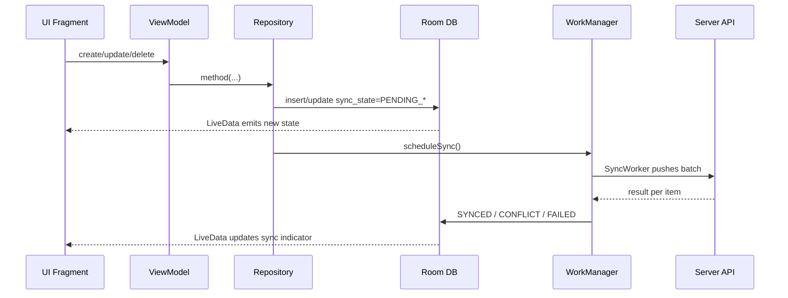

### 12.2 `SyncManager`

Методы:

- `scheduleSync()` - one-time unique work с policy `KEEP`.
- `scheduleSyncForce()` - one-time unique work с policy `REPLACE`.
- `schedulePeriodicSync()` - periodic work раз в 15 минут.

Важный текущий нюанс: в коде `buildNetworkConstraints()` сейчас возвращает пустой `Constraints.Builder().build()`. То есть архитектурный комментарий говорит "только при сети", но фактический код не ставит `NetworkType.CONNECTED`. Если сети нет, worker сам упадет на HTTP и вернет retry/failure по своей логике.

### 12.3 `SyncWorker`

Порядок работы `doWork()`:

1. Получает DAO из `AppDatabase`.
2. Создает `ApiService`.
3. Создает `AuthRepository`.
4. Если нет logged-in аккаунта - пропускает синхронизацию.
5. Получает `currentUserId`.
6. Выполняет push:
   - `syncPendingProjects()`
   - `syncPendingRooms()`
   - `syncPendingOpenings()`
   - `syncPendingEstimateItems()`
   - `syncPendingWorkers()`
   - `syncPendingWorkTasks()`
7. Выполняет pull: `pullServerChanges()`.
8. Возвращает `Result.success()`, `Result.retry()` при `IOException`, `Result.failure()` при неожиданных ошибках.

Поддерживаемые сущности sync:

- Project
- ProjectRoom
- Opening
- EstimateItem
- Worker
- WorkTask

Push:

- `PENDING_CREATE` -> operation `CREATE`
- `PENDING_UPDATE` -> operation `UPDATE`
- `PENDING_DELETE` -> operation `DELETE`
- Batch size: 50.
- Для проекта используется отдельный `POST /projects` и `DELETE /projects/{id}`.
- Для остальных сущностей - batch endpoints.

Pull:

- Читает `last_pull_at_{currentUserId}` из encrypted prefs.
- Вызывает `GET /sync/pull?since=...`.
- Применяет изменения в транзакции.
- Сохраняет checkpoint `pull.serverTime`.

Правило применения pull:

- Если локальная запись не `SYNCED`, remote change не применяется.
- Если remote version меньше локальной, не применяется.
- Это защищает локальные pending-изменения от перезаписи сервером.

### 12.4 Конфликты

Конфликт появляется, когда сервер возвращает `409` для item/room/opening/worker/workTask/project.

Клиент делает:

- Ставит entity `syncState = CONFLICT`.
- Создает `ConflictEntity`.
- Сохраняет локальный JSON и серверный snapshot.
- `SyncStatusDao` начинает показывать global status `CONFLICT`.
- `SyncStatusView` показывает желтый статус/бейдж.
- Пользователь открывает `ConflictResolutionActivity`.

Разрешение:

- "Оставить мое" -> bump version, `PENDING_UPDATE`, повторная отправка.
- "Принять сервер" -> локально перезаписать entity серверным snapshot и поставить `SYNCED`.

## 13. Android: расчет материалов, площади и totals

### 13.1 Размеры комнаты

Пользователь вводит размеры в `RoomDetailFragment`. ViewModel передает их в `RoomRepository.updateDimensionsAndRecalculate`.

Алгоритм:

- Сохраняются `length`, `width`, `height`.
- Берутся элементы комнаты.
- Считается чистая площадь стен.
- Если задана ручная площадь, она имеет приоритет.
- Пересчитываются позиции сметы с `consumptionRate != null`.
- Пересчитываются сдельные работы.

### 13.2 Добавление материала

Поток:

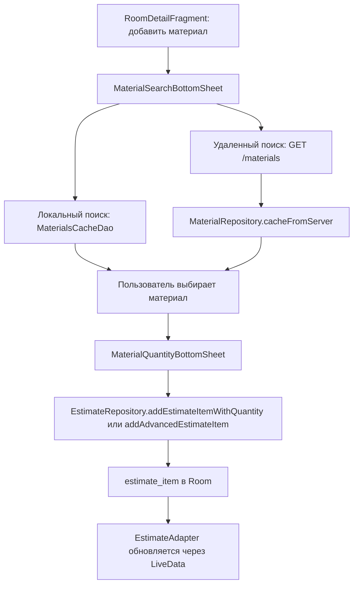

Есть два режима:

- Расчет от площади и расхода: `quantity = effectiveArea * consumptionRate`.
- Ручное количество: `consumptionRate = null`, `quantity` вводит пользователь.

### 13.3 Итоговые суммы

Материалы:

- `totalPrice = finalPrice * quantity`.
- Деньги округляются до 2 знаков.
- Количество - до 6 знаков.

Работы:

- Для сдельных работ `totalPayment` пересчитывается от effective area и ставки.
- Для фиксированных работ итог равен ставке/введенной сумме.

UI totals:

- Материалы берутся из `EstimateItemDao`.
- Работы берутся из `WorkTaskDao`.
- Сумма комнаты собирается в `RoomTotals`.

## 14. Сервер: запуск и конфигурация

### 14.1 `SMetrixServerApplication`

Точка входа Spring Boot:

- `public static void main(String[] args)`
- `SpringApplication.run(...)`

### 14.2 `application.yml`

Главные настройки:

- `server.port=8080`
- `server.address=0.0.0.0`
- PostgreSQL через env variables.
- `spring.jpa.hibernate.ddl-auto=${JPA_DDL_AUTO:update}`
- JWT secret/expiration.
- FGIS config.
- Mail config.
- CORS.

Важный риск: если `POSTGRES_PASSWORD` не задан, пароль становится пустой строкой. Для PostgreSQL с SCRAM это приводит к ошибке подключения.

### 14.3 Config-классы

| Класс | Роль |
|---|---|
| `SecurityConfig` | Stateless security, CORS, JWT filter, BCrypt, auth manager. Разрешает `/api/v1/auth/**`, `/api/v1/admin/fgis/**`, `/error`; остальное требует JWT. |
| `FgisProperties` | `@ConfigurationProperties(prefix="fgis")`: enabled, import-key, api templates, period, regions, timeouts, scheduler. |
| `FgisStartupReporter` | На `ApplicationReadyEvent` логирует состояние FGIS-конфига. |
| `DatabaseSchemaMigration` | `ApplicationRunner`, расширяет varchar-колонки через JdbcTemplate для production hardening. |
| `MailConfig` | Создает `JavaMailSender`. |
| `UuidStringConverter` | JPA AttributeConverter `String <-> UUID` для legacy/строковых UUID-полей. |

## 15. Сервер: security и авторизация

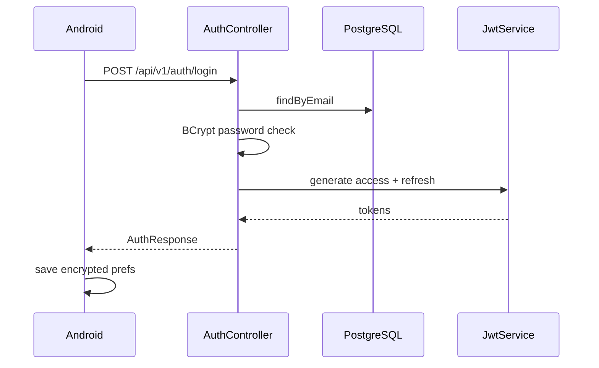

### 15.1 `AuthController`

Endpoints:

- `POST /api/v1/auth/register`
- `POST /api/v1/auth/login`
- `POST /api/v1/auth/refresh`
- `POST /api/v1/auth/logout`
- `POST /api/v1/auth/forgot-password`
- `POST /api/v1/auth/reset-password`

Логика:

- Email нормализуется lower-case.
- Пароль хранится BCrypt-хэшем.
- Login/register возвращают access + refresh + user data.
- Refresh token rotation: использованный refresh token заносится в `revoked_tokens`.
- Forgot password генерирует 6-значный код, хранит хэш кода и TTL 15 минут.
- Rate limiting через `AuthRateLimiter`.

### 15.2 `JwtService`

Роль:

- Генерирует access token.
- Генерирует refresh token.
- Встраивает token type и token id.
- Валидирует access/refresh token.
- Извлекает email, expiration, token id.

### 15.3 `JwtAuthFilter`

Роль:

- Работает перед `UsernamePasswordAuthenticationFilter`.
- Достает Bearer token из заголовка.
- Валидирует access token.
- Загружает пользователя через `UserDetailsServiceImpl`.
- Ставит Authentication в SecurityContext.

### 15.4 `UserDetailsServiceImpl`

Роль:

- Загружает `User` по email.
- Создает Spring Security `UserDetails`.

### 15.5 `AuthRateLimiter`

Роль:

- In-memory ограничение количества попыток для login/register/refresh/reset.
- Ключ строится из action + IP + identity.

## 16. Сервер: entity-модель

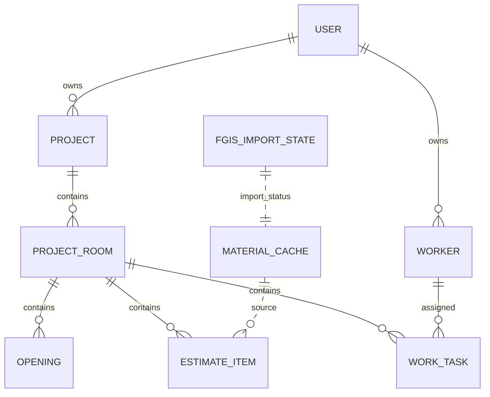

| Entity | Роль |
|---|---|
| `User` | Пользователь: id, email, passwordHash, timestamps, resetCode, resetCodeExpiresAt, name. |
| `Project` | Проект: id, userId, name, city, regionCode, taxMultiplier, logisticsMarkup, address/clientId legacy, version, timestamps, deletedAt. |
| `ProjectRoom` | Комната: id, projectId, name, length/width/height, manualAreaOverride, version, timestamps, deletedAt. |
| `Opening` | Элемент комнаты: id, projectRoomId, type, width, height, depth, placementType, version, timestamps, deletedAt. |
| `EstimateItem` | Позиция сметы: roomId, fgisCode, material/name/unit, base/final/total prices, consumption/quantity, status, extended calculation fields, version, timestamps, deletedAt. |
| `Worker` | Рабочий: userId, fullName, phone, specialty, version, timestamps, deletedAt. |
| `WorkTask` | Рабочая задача: roomId, workerId, taskName, rateType, rateValue, totalPayment, version, timestamps, deletedAt. |
| `MaterialCache` | Серверный кэш материалов: code, name, unit, price, region, quarter, consumptionRate, lastUpdated, popularityScore. |
| `UnitConversion` | Таблица серверных конвертаций единиц. |
| `RevokedToken` | Отозванные refresh tokens: token id, revokedAt, expiresAt. |
| `FgisImportState` | Состояние импорта ФГИС по региону: status, попытки, успехи, ошибки, counts. |

## 17. Сервер: repository-слой

| Repository | Роль |
|---|---|
| `UserRepository` | Поиск пользователя по email. |
| `ProjectRepository` | Проекты пользователя, changes after timestamp, owned ids, active region codes. |
| `ProjectRoomRepository` | Комнаты проекта, changed rooms for user, owned room ids, soft delete by project. |
| `OpeningRepository` | Элементы комнаты, changed openings for user, soft delete by project. |
| `EstimateItemRepository` | Позиции сметы, changed items for user, soft delete by project. |
| `WorkerRepository` | Рабочие пользователя, changes after timestamp. |
| `WorkTaskRepository` | Рабочие задачи, changed tasks for user, soft delete by project. |
| `MaterialCacheRepository` | Поиск материалов по региону/коду/name/code, stale checks, popularity increment. |
| `FgisImportStateRepository` | Хранение статуса импорта ФГИС и свежести региона. |
| `RevokedTokenRepository` | Хранение и очистка revoked refresh tokens. |
| `UnitConversionRepository` | Поиск конверсии единиц. |

## 18. Сервер: controllers и API

### 18.1 `ProjectController`

Base path: `/api/v1/projects`

Endpoints:

- `POST /api/v1/projects` - create/update проекта.
- `DELETE /api/v1/projects/{id}` - soft delete проекта.

Логика `POST`:

- Берет user по `principal.getName()`.
- Валидирует UUID проекта.
- Если project уже есть, проверяет владельца.
- Для новой записи ожидает `version=0`.
- Для существующей проверяет client version против server version.
- При конфликте возвращает `409 VERSION_CONFLICT`.
- Сохраняет проект, увеличивает version.

Логика `DELETE`:

- Проверяет владельца и client version.
- Ставит `deletedAt`, `updatedAt`, увеличивает version.
- Каскадно soft-delete дочерние комнаты, сметы, работы, opening.

### 18.2 `BatchSyncController`

Endpoints:

- `POST /api/v1/estimate-items/sync`
- `POST /api/v1/project-rooms/sync`
- `POST /api/v1/work-tasks/sync`
- `POST /api/v1/openings/sync`
- `POST /api/v1/workers/sync`

Общие правила:

- Batch не больше 50 items.
- Каждая запись обрабатывается отдельно.
- Ответ всегда `SyncBatchResponse` со списком `SyncItemResult`.
- Проверяется владелец через project/room/user.
- `CREATE`, `UPDATE`, `DELETE`.
- Если version не совпадает - result `409 VERSION_CONFLICT` с `serverSnapshot`.
- `DELETE` ставит `deletedAt`, а не удаляет физически.

Особенность estimate item:

- Сервер пересчитывает `finalPrice` сам через project tax/logistics:
  - `tax = project.taxMultiplier ?: 1`
  - `markup = project.logisticsMarkup ?: 0`
  - `factor = 1 + markup / 100`
  - `finalPrice = basePrice * tax * factor`
- `totalPrice = finalPrice * quantity`
- То есть сервер не полностью доверяет client final price.

### 18.3 `SyncController` и `SyncService`

Base path: `/api/v1/sync`

Endpoints:

- `GET /api/v1/sync/pull?since=...`
- `POST /api/v1/sync/push`

В текущем Android-клиенте активно используется `pull`, а push сделан через batch endpoints.

`SyncService.pull(email, since)`:

- Находит user.
- Берет serverTime.
- Выбирает проекты/комнаты/смету/openings/workers/tasks, измененные после `since`.
- Маппит в DTO.
- Возвращает `SyncPullResponse`.

`SyncService.push(...)`:

- Старый/альтернативный общий push по спискам DTO.
- Обрабатывает projects/rooms/estimateItems.
- Возвращает acceptedIds и conflicts.

### 18.4 `MaterialController`

Base path: `/api/v1/materials`

Endpoints:

- `GET /api/v1/materials?q=...&region=...&limit=...&offset=...`
- `GET /api/v1/materials/search?q=...&region=...`
- `POST /api/v1/materials/{code}/use?region=...`

Логика:

- Query должен быть 1..100 символов.
- Region нормализуется uppercase и валидируется.
- `limit` ограничен 1..100.
- `offset` ограничен 0..10000.
- Поиск идет через `MaterialCacheRepository.searchByRegion`, где учитываются name/code и priority.
- `recordUse` увеличивает `popularityScore`.

### 18.5 `UserController`

Base path: `/api/v1/user`

Endpoints:

- `GET /profile`
- `PUT /profile`

Роль:

- Возвращает name/email текущего пользователя.
- Обновляет profile.

### 18.6 `FgisImportController`

Base path: `/api/v1/admin/fgis`

Endpoints:

- `GET /status`
- `POST /refresh?region=...`
- `POST /import` multipart XLSX

Защита:

- Не JWT.
- Проверяет `X-FGIS-Import-Key`.
- Если `fgis.import-key` пустой - manual import считается не настроенным.
- Проверка ключа через `MessageDigest.isEqual`.

Роли:

- `/status` возвращает `FgisImportState`.
- `/refresh` запускает автоматическую загрузку региона через providers.
- `/import` принимает XLSX вручную и импортирует его.

### 18.7 `GlobalExceptionHandler`

Роль:

- Централизованный обработчик исключений.
- Возвращает `ApiErrorResponse`.

## 19. Сервер: FGIS pipeline

FGIS отвечает за наполнение серверного `material_cache`, а клиент потом ищет материалы через `/api/v1/materials`.

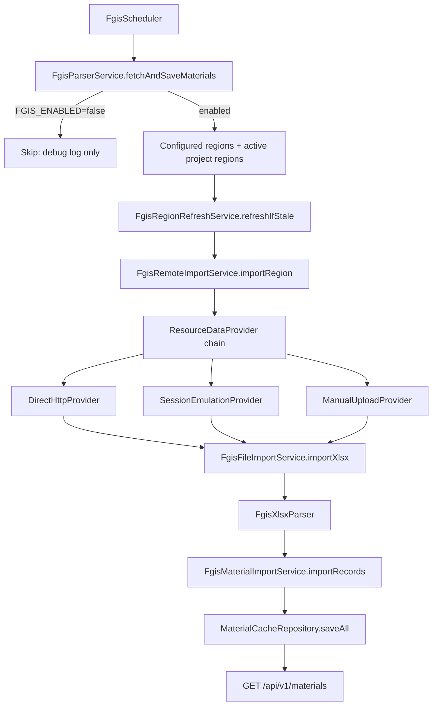

### 19.1 `FgisScheduler`

Два scheduled запуска:

- Quarterly cron: `${fgis.scheduler.cron:0 0 3 1 1,4,7,10 *}`.
- Region refresh fixed delay: `${fgis.scheduler.region-refresh-delay-ms:300000}`.

Оба вызывают `FgisParserService.fetchAndSaveMaterials()`.

### 19.2 `FgisParserService`

Роль:

- Проверяет `properties.isEnabled()`.
- Если FGIS выключен - пишет debug и выходит.
- Через `AtomicBoolean running` не дает запустить импорт параллельно.
- Собирает регионы из `fgis.api.region-codes` и активных проектов.
- Для каждого региона вызывает `FgisRegionRefreshService.refreshIfStale`.

Текущее состояние: по `application.yml` `FGIS_ENABLED` по умолчанию false, значит автоматическая цепочка молча выглядит "неактивной", если лог level не показывает debug.

### 19.3 `FgisRegionRefreshService`

Роль:

- Проверяет, свежие ли данные региона.
- Если регион устарел, запускает remote import.
- Опирается на `FgisImportStateRepository` и `MaterialCacheRepository`.

### 19.4 `FgisRemoteImportService`

Роль:

- Валидирует region.
- Определяет период через `FgisPeriod.resolve(...)`.
- Помечает импорт running.
- Перебирает `ResourceDataProvider`.
- Первый provider, который вернул `ResourcePayload`, отдает stream в `FgisFileImportService`.
- При успехе пишет state success.
- При ошибках пишет state failed и пробрасывает ошибку.

### 19.5 Providers

| Provider | Роль |
|---|---|
| `ResourceDataProvider` | Интерфейс: `name()`, `fetch(region, period)`. |
| `DirectHttpProvider` | Загружает XLSX по `download-url-template`. Требует корректный URL/template. |
| `SessionEmulationProvider` | Пытается использовать session-url/template, затем загрузку. |
| `ManualUploadProvider` | Provider для ручного сценария загрузки. |
| `ResourcePayload` | AutoCloseable record: provider name + InputStream. |
| `LimitedInputStream` | Ограничивает размер загрузки. |

### 19.6 `FgisFileImportService`

Роль:

- Принимает XLSX InputStream, region, quarter.
- Вызывает `FgisXlsxParser.parse`.
- Собирает `FgisMaterialRecord` партиями.
- Передает записи в `FgisMaterialImportService`.
- Возвращает `FgisFileImportResult(parsing, database)`.

### 19.7 `FgisXlsxParser`

Роль:

- Потоково читает XLSX через Apache POI SAX/event API.
- Временно копирует workbook во временный файл.
- Проходит все sheets.
- Автоматически находит колонки code/name/unit/price/consumption по заголовкам.
- Ищет период в строках по pattern вроде `1 квартал 2026`.
- Пропускает служебную строку номеров колонок (`1 | 2 | 3 | 4`).
- Парсит числа с пробелами/запятыми.
- Создает `FgisMaterialRecord(code, name, unit, price, regionCode, quarter, consumptionRate)`.
- Если не найдено ни одной записи - кидает IOException.

### 19.8 `FgisMaterialImportService`

Роль:

- Нормализует record.
- Отбрасывает невалидные строки.
- Группирует по region.
- Находит существующие материалы по region+code.
- Создает новые, обновляет измененные, считает unchanged/rejected.
- Сохраняет changed materials через `MaterialCacheRepository.saveAll`.

### 19.9 `FgisImportStateService`

Роль:

- `markRunning(region)`.
- `markSuccess(region, result)`.
- `markFailed(region, exception)`.
- `findAll()`.
- Хранит counts created/updated/unchanged/rejected и last error.

## 20. Связь Android и сервера

### 20.1 Base URL

Android Retrofit:

- Debug/current flavor `usb`: `http://127.0.0.1:8080/api/v1/`.
- Release: `https://api.smetrix.ru/api/v1/`.

Сервер:

- `server.address=0.0.0.0`
- `server.port=8080`
- Все публичные endpoints начинаются с `/api/v1/...`.

### 20.2 DTO-контракт

| Android DTO | Server DTO / endpoint |
|---|---|
| `LoginRequest` | `AuthRequest` на `/auth/login`. |
| `RegisterRequest` | `AuthRequest` на `/auth/register`. |
| `TokenResponse` | `AuthResponse`. |
| `ProjectDto` | `ProjectDto` на `/projects`. |
| `ProjectRoomDto` | Map item в `SyncBatchRequest` на `/project-rooms/sync`. |
| `EstimateItemDto` | Map item в `SyncBatchRequest` на `/estimate-items/sync`. |
| `OpeningDto` | Map item в `SyncBatchRequest` на `/openings/sync`. |
| `WorkerDto` | Map item в `SyncBatchRequest` на `/workers/sync`. |
| `WorkTaskDto` | Map item в `SyncBatchRequest` на `/work-tasks/sync`. |
| `MaterialSearchResponse` | `MaterialSearchResponse` на `/materials`. |
| `MaterialDto` | `MaterialDto` в ответе `/materials`. |
| `SyncPullResponse` | `SyncPullResponse` на `/sync/pull`. |
| `SyncBatchResponse` | `SyncBatchResponse` на batch endpoints. |
| `SyncItemResult` | Per-item status внутри batch response. |

### 20.3 Поля, которые особенно важны для sync

- `id` - клиент генерирует id до отправки.
- `operation` - `CREATE`, `UPDATE`, `DELETE`.
- `version` - optimistic locking.
- `created_at`, `updated_at`, `deleted_at`.
- `sync_state` - только локальное поле Android, сервер его не хранит.
- `server_snapshot` - JSON серверной версии при конфликте.

## 21. Полный пользовательский сценарий: от запуска до сметы

1. Пользователь запускает приложение.
2. `SMetrixApplication` поднимает процесс.
3. `SplashActivity` проверяет `AuthRepository.hasActiveSession()`.
4. Если сессии нет - `AuthActivity` -> `LoginFragment`.
5. Пользователь вводит email/password.
6. `LoginFragment` вызывает `AuthViewModel.login`.
7. `AuthViewModel` валидирует email/password и вызывает `ApiService.login`.
8. Сервер `AuthController.login` проверяет пользователя, BCrypt password, возвращает tokens.
9. `AuthRepository.saveTokens` сохраняет tokens/userId в encrypted prefs.
10. Открывается `MainActivity`.
11. `MainActivity` показывает `ProjectListFragment`.
12. `ProjectListViewModel` берет `LiveData<List<ProjectEntity>>`.
13. Пользователь создает проект.
14. `ProjectRepository.createProject` пишет `ProjectEntity` в Room с `PENDING_CREATE`.
15. UI сразу показывает проект.
16. `SyncManager.scheduleSync` ставит `SyncWorker`.
17. Пользователь открывает проект -> `RoomListFragment`.
18. Создает комнату -> `RoomRepository.createRoom`, `PENDING_CREATE`.
19. Открывает комнату -> `RoomDetailFragment`.
20. Вводит размеры комнаты.
21. `RoomRepository.updateDimensionsAndRecalculate` сохраняет размеры, считает площадь, пересчитывает смету и работы.
22. Добавляет проемы/колонны/вентиляцию.
23. `RoomRepository.addOpening/deleteOpening` меняет элементы и пересчитывает.
24. Нажимает добавить материал.
25. `MaterialSearchBottomSheet` ищет локально и, если включено, удаленно через `/materials`.
26. Сервер `MaterialController` ищет в `material_cache`.
27. Клиент кэширует найденное в `materials_cache`.
28. Пользователь выбирает материал и вводит количество.
29. `EstimateRepository.addEstimateItemWithQuantity` создает позицию с `consumptionRate=null`, считает total, ставит `PENDING_CREATE`.
30. UI `EstimateAdapter` показывает строку и сумму.
31. Пользователь добавляет работы/рабочих.
32. Репозитории пишут в Room и планируют sync.
33. `SyncWorker` отправляет pending batch на сервер.
34. Сервер проверяет пользователя, ownership, version.
35. При успехе сервер возвращает version/updatedAt.
36. Клиент ставит `SYNCED`.
37. При конфликте клиент ставит `CONFLICT` и показывает статус.
38. Pull sync подтягивает изменения с сервера после checkpoint.

## 22. Валидация данных

### 22.1 На клиенте

Клиент валидирует:

- Email/password в `AuthViewModel`.
- Название проекта/числовые поля в `ProjectListFragment` и `ProjectRepository`.
- Названия/размеры/площади в room flow.
- Material quantity/base price/final price/name/unit в `EstimateRepository`.
- Worker fields в `WorkerRepository`.
- Query/ручной материал в `MaterialSearchBottomSheet`.

Главное правило чисел:

- Финансы, площади, количества - `BigDecimal`.
- Room хранит `BigDecimal` как `TEXT` через `BigDecimalConverter`.

### 22.2 На сервере

Сервер валидирует:

- AuthRequest через validation + ручная логика email/password/reset code.
- UUID в controllers.
- Ownership через repositories.
- Version для optimistic locking.
- Batch size <= 50.
- Operation только `CREATE`, `UPDATE`, `DELETE`.
- Неотрицательные BigDecimal для цен/размеров/quantity/rate.
- Region/query для materials.
- FGIS import key и XLSX file.

## 23. Конфигурационные файлы

### 23.1 Android Gradle

`settings.gradle`:

- Подключает plugin repositories и dependency repositories.
- Подключает модуль `:app`.

Корневой `build.gradle`:

- Минимальная Gradle-конфигурация верхнего уровня.

`app/build.gradle`:

- Главная конфигурация Android-модуля.
- Включает ViewBinding и BuildConfig.
- Задает flavors и API base URL.
- Подключает Room/Retrofit/WorkManager/Security/Lifecycle/UI libs.
- Подключает Room schema export.

`gradle.properties`:

- Настройки Gradle/Android plugin/JVM.

`local.properties`:

- Локальные пути SDK и локальные параметры вроде `PHONE_SERVER_IP`.
- Не должен попадать в Git.

### 23.2 Android Manifest и XML

`AndroidManifest.xml`:

- INTERNET permission.
- `SMetrixApplication`.
- `networkSecurityConfig`.
- Launcher `SplashActivity`.
- `AuthActivity`, `MainActivity`, `ConflictResolutionActivity`.

`network_security_config.xml`:

- Управляет cleartext HTTP.
- Важно для debug HTTP на `127.0.0.1:8080`.

Layout XML:

- `activity_auth.xml`, `activity_main.xml`, `activity_conflict_resolution.xml`.
- `fragment_login/register/forgot/reset/profile`.
- `fragment_project_list`, `fragment_room_list`, `fragment_room_detail`, `fragment_worker_list`.
- Dialog layouts для создания проекта/комнаты/работы/элементов.
- Item layouts для RecyclerView.

### 23.3 Server Maven и YAML

`pom.xml`:

- Spring Boot parent.
- Dependencies.
- Maven compiler и spring boot plugin.

`application.yml`:

- Runtime config сервера.
- Для production нельзя оставлять дефолтный JWT secret.
- Для PostgreSQL нужно задать password.
- Для FGIS нужно явно включить `FGIS_ENABLED=true`, задать import key и рабочие URL/templates или использовать manual upload.

`.env.example`:

- Подсказка для переменных окружения.
- Важно: сам Spring Boot здесь не подгружает `.env` автоматически, если запуск не настроен отдельно.

Flyway migrations:

- `V1__production_hardening.sql`
- `V2__add_consumption_rate.sql`
- `V3__add_estimate_item_calc_fields.sql`

## 24. Текущее реальное состояние и важные нюансы

1. Клиент и сервер уже имеют основную offline-first архитектуру: Room, sync states, WorkManager, Retrofit, batch endpoints, pull sync.
2. Гостевой режим есть и хранит локальные данные под специальным userId.
3. Авторизация есть: JWT access/refresh, encrypted prefs на Android, refresh rotation на сервере.
4. Конфликты есть на обоих концах: сервер возвращает 409/snapshot, клиент хранит `ConflictEntity` и дает варианты разрешения.
5. Материалы ищутся через серверный `material_cache`; Android не скачивает ФГИС напрямую.
6. FGIS parser/import pipeline в коде есть, включая manual upload и XLSX parser.
7. FGIS автоматом по текущему `application.yml` выключен (`FGIS_ENABLED=false`). Без переменных окружения и URL/template он не будет сам наполнять материалы.
8. `SyncManager` сейчас не ставит network constraint, хотя комментарии и RFC описывают `NetworkType.CONNECTED`.
9. Текущий Android flavor `usb` использует `127.0.0.1`; для телефона без USB reverse это не адрес компьютера.
10. Серверный `BatchSyncController` сам пересчитывает `finalPrice` для estimate item, поэтому клиентская и серверная формулы должны оставаться согласованными.
11. `EstimateRepository.deleteEstimateItem` физически удаляет item локально, а не помечает `PENDING_DELETE`; это может быть проблемой для синхронизации удаления уже синхронизированных item.
12. `POST /sync/push` на сервере существует, но текущий Android-код в основном использует batch endpoints + pull.

## 25. Как классы связаны между собой

### 25.1 Создание проекта

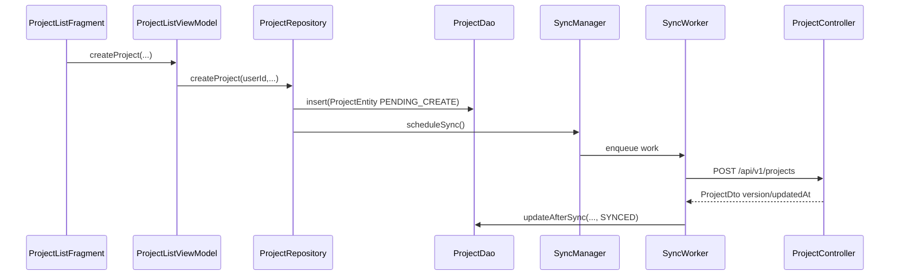

### 25.2 Создание комнаты и пересчет

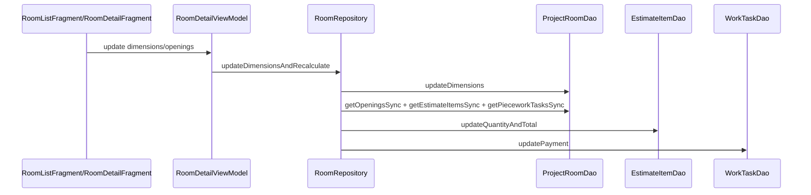

### 25.3 Поиск материалов

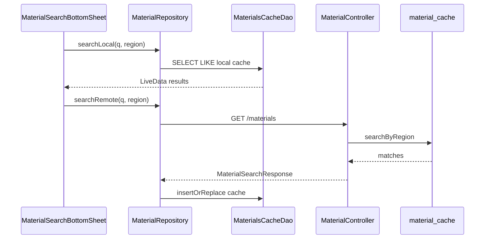

### 25.4 Конфликт

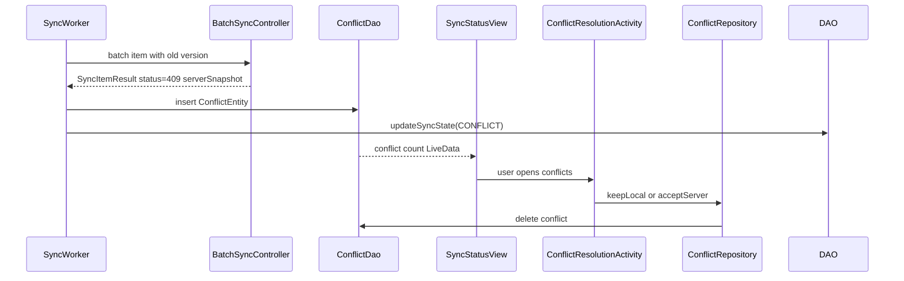

## 26. Что стоит держать в голове дальше

Этот проект уже не "просто UI": в нем есть полноценная offline-first база, серверный sync, JWT, FGIS pipeline и расчетная логика. Главные зоны, которые требуют особого внимания при дальнейшем развитии:

- Согласовать текущую реализацию `SyncManager` с требованием "только при сети".
- Проверить и, возможно, поправить delete flow для `EstimateItem`.
- Привести build flavors к реальным сценариям: emulator, USB, phone.
- Явно документировать и проверять FGIS operational readiness: parser code есть, но auto import выключен конфигом.
- Поддерживать одинаковую формулу цены клиента и сервера.
- Для production заменить дефолтный JWT secret, настроить Postgres env и CORS.

## 27. Инвентаризация классов Android-клиента

Этот раздел нужен как быстрый справочник: какой класс где лежит и зачем нужен.

### 27.1 Корневой пакет

| Класс | Роль |
|---|---|
| `SMetrixApplication` | Application-класс процесса; место для глобальной инициализации приложения. |
| `SplashActivity` | Launcher entrypoint; решает, открыть auth flow или main flow. |
| `MainActivity` | Основной контейнер приложения после входа; toolbar, меню, `SyncStatusView`, fragment navigation, logout broadcast. |

### 27.2 `db`

| Класс | Роль |
|---|---|
| `AppDatabase` | Room database singleton, миграции 1-7, DAO accessors, seed unit conversions. |
| `BigDecimalConverter` | TypeConverter для хранения `BigDecimal` как точной строки. |

### 27.3 `db.entity`

| Класс | Роль |
|---|---|
| `ProjectEntity` | Локальная таблица проекта: user, name, city, region, tax/logistics, deletedAt, sync metadata. |
| `ProjectRoomEntity` | Локальная таблица комнаты: projectId, name, geometry, manual area, sync metadata. |
| `OpeningEntity` | Элемент комнаты: door/window/vent/column, размеры, placement, sync metadata. |
| `EstimateItemEntity` | Позиция сметы: material identity, prices, consumption/quantity, advanced calculation fields, status, sync metadata. |
| `WorkerEntity` | Рабочий пользователя: name, phone, specialty, sync metadata. |
| `WorkTaskEntity` | Рабочая задача: room, worker, task, rate, total payment, sync metadata. |
| `MaterialsCacheEntity` | Локальный material cache по code+region: name, unit, price, consumptionRate, source, priority. |
| `UnitConversionEntity` | Таблица локальных коэффициентов единиц измерения. |
| `ConflictEntity` | Таблица конфликтов: entityId/type, localSnapshot, serverSnapshot, detectedAt. |

### 27.4 `db.dao`

| Класс | Роль |
|---|---|
| `ProjectDao` | SQL-операции проекта, выборка активных проектов, sync update, pending queues. |
| `ProjectRoomDao` | SQL-операции комнат, выборка комнат проекта, sync queues, sync helper queries для пересчета. |
| `OpeningDao` | SQL-операции элементов комнаты, soft delete, sync update/upsert. |
| `EstimateItemDao` | SQL-операции сметы, update quantity/total/manual quantity/status, sync queues. |
| `WorkerDao` | SQL-операции рабочих, list by user, soft delete, sync queues. |
| `WorkTaskDao` | SQL-операции задач, totals, payment update, soft delete, sync queues. |
| `MaterialsCacheDao` | Локальный поиск материалов, insert/replace, priority increment. |
| `UnitConversionDao` | Доступ к таблице конвертации единиц. |
| `ConflictDao` | Доступ к conflict table, count/list/delete. |
| `SyncStatusDao` | Агрегирует общий sync status по нескольким таблицам. |

### 27.5 `repository`

| Класс | Роль |
|---|---|
| `AuthRepository` | Сессия, encrypted prefs, guest mode, token save/refresh/clear. |
| `ProjectRepository` | Offline-first операции с проектами и каскадный soft delete. |
| `RoomRepository` | Комнаты, геометрия, openings, work tasks, пересчет сметы/работ. |
| `EstimateRepository` | Позиции сметы, валидация, расчет quantity/total, ручное количество. |
| `MaterialRepository` | Локальный/удаленный поиск материалов, кэширование, usage popularity. |
| `WorkerRepository` | Рабочие: create/update/delete/list, валидация, sync scheduling. |
| `ConflictRepository` | Разрешение конфликтов: keep local или accept server. |
| `AppExecutors` | Общий фоновой executor для disk IO. |

### 27.6 `viewmodel`

| Класс | Роль |
|---|---|
| `AuthViewModel` | Auth state, login/register/forgot/reset, validation, guest mode. |
| `ProfileViewModel` | Профиль пользователя: load/update/logout state. |
| `ProjectListViewModel` | LiveData проектов и команды create/update/delete. |
| `RoomListViewModel` | LiveData комнат проекта и команды create/delete/rename. |
| `RoomListViewModelFactory` | Factory для передачи `projectId`. |
| `RoomDetailViewModel` | Данные и действия экрана комнаты: смета, материалы, openings, workers/tasks, totals. |
| `WorkerViewModel` | LiveData рабочих и команды save/update/delete. |
| `SyncViewModel` | Общий статус синхронизации, конфликт count/list, force sync. |

### 27.7 `ui.auth`

| Класс | Роль |
|---|---|
| `AuthActivity` | Activity-контейнер auth-фрагментов. |
| `LoginFragment` | Экран входа, guest mode, переходы к register/forgot. |
| `RegisterFragment` | Экран регистрации. |
| `ForgotPasswordFragment` | Запрос кода восстановления по email. |
| `ResetPasswordFragment` | Ввод кода и нового пароля. |
| `ProfileFragment` | Профиль, сохранение имени/email, logout. |

### 27.8 `ui.project`, `ui.room`, `ui.adapter`, `ui.common`, `ui.conflict`

| Класс | Роль |
|---|---|
| `ProjectListFragment` | Список проектов, dialogs create/edit/delete, переход к комнатам. |
| `ProjectAdapter` | Adapter карточек проектов и sync-dot. |
| `RoomListFragment` | Список комнат проекта, dialogs create/edit/delete, переход к деталям. |
| `RoomDetailFragment` | Главный экран комнаты: размеры, элементы, смета, материалы, работы, totals. |
| `RoomDetailViewModelFactory` | Factory для `RoomDetailViewModel`. |
| `RoomAdapter` | Adapter комнат. |
| `EstimateAdapter` | Adapter позиций сметы, статусы, количество, цена, итог. |
| `EstimateDiffCallback` | DiffUtil для сметных строк. |
| `WorkTaskAdapter` | Adapter рабочих задач. |
| `WorkerListFragment` | Список рабочих и dialogs create/edit/delete. |
| `WorkerAdapter` | Adapter рабочих. |
| `MaterialSearchBottomSheet` | Поиск/ручное создание материала. |
| `MaterialSearchAdapter` | Adapter результатов поиска материалов. |
| `MaterialQuantityBottomSheet` | Ввод количества выбранного материала. |
| `SyncStatusView` | Виджет статуса sync и конфликтов. |
| `ConflictResolutionActivity` | Экран разрешения sync-конфликтов. |

### 27.9 `network`

| Класс | Роль |
|---|---|
| `ApiClient` | Singleton Retrofit/OkHttp, base URL, interceptors. |
| `ApiService` | Retrofit interface для всех REST endpoints. |
| `AuthInterceptor` | Bearer token, 401 refresh, logout broadcast. |
| `ApiErrorHandler` | Парсинг серверных ошибок в сообщения. |
| `NetworkUtils` | Утилиты проверки сети. |
| `SyncManager` | Планирование WorkManager sync jobs. |
| `SyncWorker` | Фоновый push/pull sync worker. |

### 27.10 `network.dto`

| DTO | Роль |
|---|---|
| `LoginRequest` | Тело login: email/password. |
| `RegisterRequest` | Тело register: name/email/password. |
| `RegisterResponse` | Ответ регистрации, включая токены/user. |
| `ForgotPasswordRequest` | Тело forgot password: email. |
| `TokenResponse` | Access/refresh tokens, expiration, user fields. |
| `UserProfileRequest` | Тело update profile. |
| `ProjectDto` | DTO проекта для `/projects`. |
| `ProjectRoomDto` | DTO комнаты для batch sync. |
| `OpeningDto` | DTO opening для batch sync. |
| `EstimateItemDto` | DTO позиции сметы для batch sync. |
| `WorkerDto` | DTO рабочего для batch sync. |
| `WorkTaskDto` | DTO рабочей задачи для batch sync. |
| `SyncBatchRequest` | Batch request: projectId + items. |
| `SyncBatchResponse` | Batch response: list of results, size, processedAt. |
| `SyncItemResult` | Per-item status/version/error/serverSnapshot. |
| `SyncPullResponse` | Pull response: projects/rooms/items/openings/workers/tasks/serverTime. |
| `MaterialDto` | Материал из `/materials`: fgisCode, name, unit, price, region, quarter, priority, consumption. |
| `MaterialSearchResponse` | Page-like response для поиска материалов. |
| `ApiErrorResponse` | Структура ошибки API. |

### 27.11 `model` и `utils`

| Класс | Роль |
|---|---|
| `SyncState` | Enum локальных sync-state. |
| `ItemStatus` | Enum статусов позиции сметы. |
| `SyncStatusResult` | UI-модель общего sync-status. |
| `RoomTotals` | UI-модель totals комнаты. |
| `EstimateItemDisplay` | UI-модель позиции сметы. |
| `EstimateItemMapper` | Entity -> display mapper. |
| `UuidGenerator` | Генератор id. |
| `SecurePrefsHelper` | EncryptedSharedPreferences factory. |
| `UnitConversionEngine` | Конвертация величин между единицами. |
| `UnitNormalizer` | Нормализация единиц к canonical unit/group. |
| `UnitGroup` | Enum групп единиц. |
| `RoomGeometryCalculator` | Универсальный расчет геометрии комнаты. |
| `QuantityCalculationMethod` | Enum методов расчета количества. |
| `QuantityMethodProvider` | Доступные методы по типу единиц. |
| `QuantityCalculationEngine` | Расширенный расчет количества и формулы. |

## 28. Инвентаризация классов SMetrix-Server

### 28.1 Root, config, scheduler

| Класс | Роль |
|---|---|
| `SMetrixServerApplication` | Spring Boot entrypoint. |
| `SecurityConfig` | SecurityFilterChain, CORS, stateless JWT, BCrypt. |
| `FgisProperties` | Typed FGIS config из `application.yml`. |
| `FgisStartupReporter` | Логирует FGIS config при готовности приложения. |
| `DatabaseSchemaMigration` | Runtime schema hardening через JdbcTemplate. |
| `MailConfig` | JavaMailSender bean. |
| `UuidStringConverter` | JPA converter String/UUID. |
| `FgisScheduler` | Scheduled запуск FGIS import/refresh. |

### 28.2 Controllers

| Класс | Роль |
|---|---|
| `AuthController` | Register/login/refresh/logout/forgot/reset. |
| `UserController` | Get/update profile. |
| `ProjectController` | Create/update project и soft delete project. |
| `BatchSyncController` | Batch sync для estimate items, rooms, openings, workers, tasks. |
| `SyncController` | Pull/push sync facade. |
| `MaterialController` | Поиск материалов и record usage. |
| `FgisImportController` | Admin FGIS status/refresh/manual XLSX import. |
| `GlobalExceptionHandler` | Единый формат ошибок. |

### 28.3 Services

| Класс | Роль |
|---|---|
| `SyncService` | Pull/push sync service, маппинг entities <-> sync DTO. |
| `SoftDeleteCleanupService` | Scheduled cleanup для soft-deleted данных. |
| `MailService` | Отправка email восстановления пароля. |
| `AdminAlertService` | Оповещения админа о FGIS failures. |
| `FgisParserService` | Главный entrypoint scheduled FGIS flow, gate by `fgis.enabled`. |
| `FgisRegionRefreshService` | Проверка свежести региона и запуск refresh. |
| `FgisRemoteImportService` | Перебор providers, загрузка XLSX, state success/failure. |
| `FgisFileImportService` | XLSX stream -> parser -> DB import result. |
| `FgisMaterialImportService` | Normalize/upsert material records в `material_cache`. |
| `FgisImportStateService` | Хранение статуса импорта региона. |

### 28.4 Security

| Класс | Роль |
|---|---|
| `JwtService` | Генерация/валидация JWT, access/refresh, token id. |
| `JwtAuthFilter` | Bearer auth filter для защищенных endpoints. |
| `UserDetailsServiceImpl` | Spring Security user lookup по email. |
| `AuthRateLimiter` | In-memory rate limiter auth endpoints. |

### 28.5 Entities

| Класс | Роль |
|---|---|
| `User` | Пользователь, password hash, reset code, timestamps. |
| `Project` | Серверный проект, owner, region, коэффициенты, version/deletedAt. |
| `ProjectRoom` | Серверная комната проекта. |
| `Opening` | Серверный элемент комнаты. |
| `EstimateItem` | Серверная позиция сметы. |
| `Worker` | Серверный рабочий пользователя. |
| `WorkTask` | Серверная задача/оплата. |
| `MaterialCache` | Серверный кэш материалов ФГИС. |
| `UnitConversion` | Серверная таблица конверсии единиц. |
| `RevokedToken` | Отозванный refresh token. |
| `FgisImportState` | Статус FGIS import по региону. |

### 28.6 Repositories

| Класс | Роль |
|---|---|
| `UserRepository` | JPA access к user, findByEmail. |
| `ProjectRepository` | Projects by user, changed projects, owned ids, active regions. |
| `ProjectRoomRepository` | Rooms, changed rooms, owned ids, soft delete by project. |
| `OpeningRepository` | Openings, changed openings, soft delete by project. |
| `EstimateItemRepository` | Estimate items, changed items, soft delete by project. |
| `WorkerRepository` | Workers by user, changed workers. |
| `WorkTaskRepository` | Work tasks, changed tasks, soft delete by project. |
| `MaterialCacheRepository` | Material search/upsert/popularity/freshness. |
| `FgisImportStateRepository` | Import state and freshness checks. |
| `RevokedTokenRepository` | Revoked refresh tokens and cleanup. |
| `UnitConversionRepository` | Unit conversion lookup. |

### 28.7 DTO

| DTO | Роль |
|---|---|
| `AuthRequest` | Auth input: email/password/name. |
| `AuthResponse` | Auth output: tokens, expiration, user data. |
| `ApiErrorResponse` | Unified error body. |
| `UserProfileUpdateRequest` | Profile update body. |
| `ProjectDto` | Project response/request for project controller. |
| `ProjectSyncDto` | Project payload for pull/push sync. |
| `RoomSyncDto` | Room payload for pull/push sync. |
| `OpeningSyncDto` | Opening payload for pull sync. |
| `EstimateItemSyncDto` | Estimate item payload for sync. |
| `WorkerSyncDto` | Worker payload for sync. |
| `WorkTaskSyncDto` | Work task payload for sync. |
| `SyncPullResponse` | Pull response with all changed entity lists. |
| `SyncPushRequest` | Legacy/general push request. |
| `SyncPushResponse` | Legacy/general push response with accepted/conflicts. |
| `SyncBatchRequest` | Batch sync request with generic item maps. |
| `SyncBatchResponse` | Batch sync response. |
| `SyncItemResult` | Per-item batch result. |
| `ConflictDto` | Conflict payload. |
| `MaterialDto` | Material API item. |
| `MaterialSearchResponse` | Material API search response. |

### 28.8 `fgis`

| Класс | Роль |
|---|---|
| `FgisPeriod` | Resolve configured/latest period, returns value like `2026-Q1`. |
| `FgisMaterialRecord` | Parsed material record from XLSX. |
| `FgisImportResult` | DB import counts: created/updated/unchanged/rejected. |
| `FgisFileImportResult` | Combined parsing result + DB result. |
| `FgisXlsxParseResult` | XLSX parsing counts: records/rejectedRows/sheets. |
| `FgisXlsxParser` | Streaming XLSX parser. |
| `ResourceDataProvider` | Provider interface for FGIS resource loading. |
| `DirectHttpProvider` | Direct URL/template download provider. |
| `SessionEmulationProvider` | Session/template based provider. |
| `ManualUploadProvider` | Manual upload provider/fallback component. |
| `ResourcePayload` | Provider name + stream wrapper. |
| `LimitedInputStream` | Input stream size guard. |
