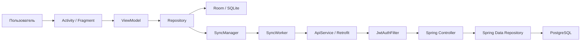
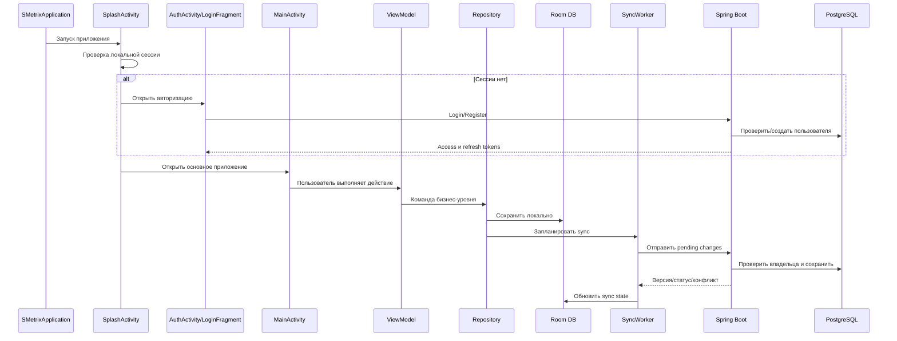
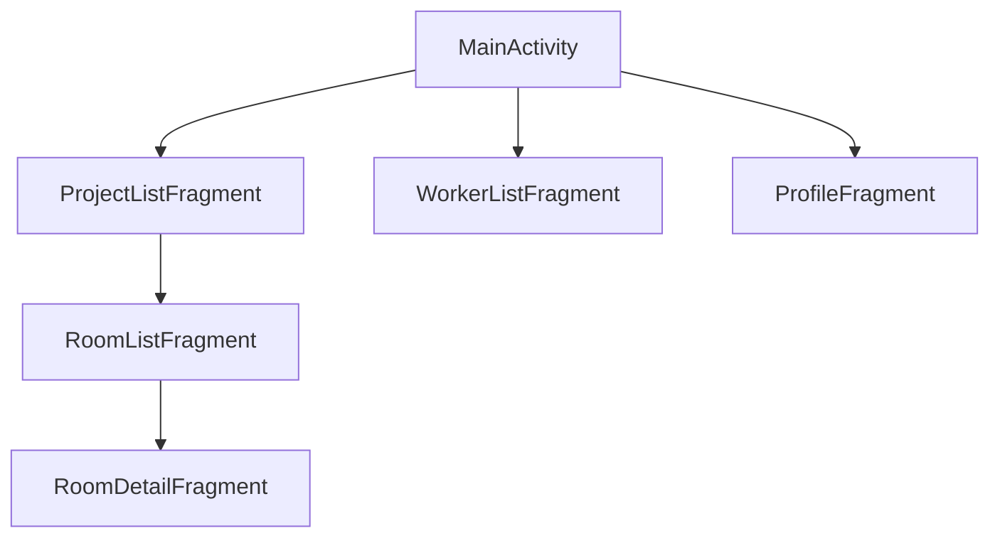
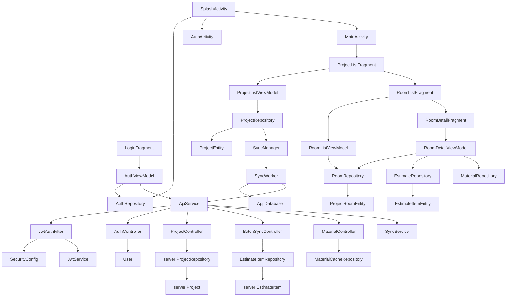

# SMetrix: подробный разбор публичных классов и авторских файлов

Дата актуализации: 2026-06-24

Этот документ описывает публичную версию репозитория SMetrix:

- 25 выбранных Java-классов Android-клиента;
- 15 выбранных Java-классов SMetrix-Server;
- авторские XML-разметки и ресурсы интерфейса;
- проектные Gradle/Maven/YAML/SQL-настройки;
- архитектурную документацию.

Автоматически созданные или стандартные файлы не рассматриваются как авторская
бизнес-логика. Они перечислены отдельно в конце документа.

## 1. Важное ограничение публичной версии

Репозиторий подготовлен как демонстрационная версия для просмотра архитектуры.
В нем сохранены основные классы, но скрыта часть их зависимостей: DAO, DTO,
адаптеры, вспомогательные Entity, ViewModelFactory, utility-классы и некоторые
контроллеры/сервисы сервера.

Поэтому опубликованные классы показывают настоящую логику проекта, но текущий
публичный набор нельзя собрать отдельно. Например:

- `AppDatabase` ссылается на DAO, которых нет в публичном наборе;
- `ApiService` использует DTO, которых нет в публичном наборе;
- `RoomDetailFragment` использует адаптеры и дополнительные ViewModel;
- `SyncWorker` использует все Entity, DAO и DTO синхронизации;
- серверные Controller используют DTO и Repository, скрытые из публичного набора.

На защите это нужно формулировать честно:

> В репозитории опубликована демонстрационная выборка ключевого авторского кода.
> Полная рабочая версия содержит дополнительные технические классы, которые
> обеспечивают компиляцию, маппинг и инфраструктуру.

## 2. Общая архитектура



Ответственность слоев:

| Слой | Ответственность |
|---|---|
| Activity/Fragment | Показывает интерфейс, получает пользовательский ввод, наблюдает LiveData. |
| ViewModel | Хранит состояние экрана и предоставляет UI команды высокого уровня. |
| Repository | Выполняет бизнес-операции, локальную запись, расчеты и планирование sync. |
| Room | Хранит offline-данные Android-приложения. |
| Retrofit | Преобразует вызовы Java-interface в HTTP-запросы. |
| WorkManager | Выполняет отложенную и периодическую синхронизацию. |
| Spring Security | Проверяет JWT и определяет текущего пользователя. |
| Controller | Реализует REST endpoints и проверяет входные данные/владельца. |
| JPA Repository | Выполняет запросы к PostgreSQL. |
| Entity | Описывает структуру таблицы и данные предметной области. |

## 3. Полный сценарий работы



# Часть I. Android-клиент

## 4. Запуск и Activity

### 4.1 `SMetrixApplication`

Тип: `Application`.

Это первый авторский класс, создаваемый Android-процессом. Он объявлен через
`android:name=".SMetrixApplication"` в `AndroidManifest.xml`.

Логика:

1. Android создает объект приложения раньше Activity.
2. В `onCreate()` получается глобальный `WorkManager`.
3. Создается `SyncManager`.
4. Планируется периодическая синхронизация.

Почему это правильное место:

- инициализация выполняется один раз на процесс;
- код не зависит от конкретного экрана;
- периодический Worker существует независимо от навигации пользователя.

Связи:

```text
Android OS -> SMetrixApplication -> WorkManager -> SyncManager
```

### 4.2 `SplashActivity`

Тип: launcher `AppCompatActivity`.

Назначение: выбрать начальный пользовательский поток.

Алгоритм:

1. Создает `ApiService` через `ApiClient`.
2. Создает `AuthRepository`.
3. Вызывает `hasActiveSession()`.
4. При активной сессии или guest mode открывает `MainActivity`.
5. При отсутствии сессии открывает `AuthActivity`.
6. Завершает себя, чтобы Splash не оставался в back stack.

Зависимости:

```text
SplashActivity -> ApiClient -> ApiService
SplashActivity -> AuthRepository
SplashActivity -> AuthActivity или MainActivity
```

### 4.3 `AuthActivity`

Тип: контейнерная Activity авторизации.

Ответственность:

- создает ViewBinding для `activity_auth.xml`;
- размещает первый `LoginFragment`;
- служит контейнером для login/register/forgot/reset flow;
- поддерживает кнопку Up/Back;
- не содержит сетевой бизнес-логики.

Разделение ответственности:

- Activity управляет контейнером;
- Fragment управляет конкретной формой;
- `AuthViewModel` выполняет auth-команды;
- `AuthRepository` хранит сессию.

### 4.4 `MainActivity`

Тип: основная Activity приложения.

Ответственность:

- создает основную оболочку из `activity_main.xml`;
- на первом запуске размещает `ProjectListFragment`;
- подключает toolbar и `menu_main.xml`;
- открывает список рабочих и профиль;
- создает/наблюдает `SyncViewModel`;
- подключает `SyncStatusView`;
- регистрирует `BroadcastReceiver` выхода;
- предоставляет общий метод `showFragment`.

Жизненный цикл:

- `onCreate()` создает интерфейс и начальный Fragment;
- `onStart()` регистрирует logout receiver;
- `onStop()` снимает receiver;
- `onCreateOptionsMenu()` загружает меню;
- `onOptionsItemSelected()` обрабатывает действия toolbar.

Навигация:



`showFragment(fragment, tag, addToBackStack)` централизует замены Fragment.
Параметр `addToBackStack` определяет, вернется ли пользователь назад стандартной
кнопкой Android.

## 5. Авторизация

### 5.1 `LoginFragment`

Тип: экран входа.

Основные действия:

1. Создает binding `FragmentLoginBinding`.
2. Получает `AuthViewModel`.
3. Читает email и пароль.
4. Передает их в `AuthViewModel.login`.
5. Наблюдает loading, error и loginSuccess.
6. При успехе открывает `MainActivity`.
7. Позволяет перейти к регистрации или восстановлению пароля.
8. Позволяет войти в guest mode.

Почему Fragment не вызывает API:

- он отвечает только за UI;
- валидация находится в ViewModel;
- сохранение токенов находится в Repository;
- сетевой интерфейс создается централизованно.

`onDestroyView()` обнуляет binding. Это важно, потому что Fragment может
продолжать жить после уничтожения своей View.

### 5.2 `AuthViewModel`

Тип: `AndroidViewModel`.

Состояние:

- `loading`;
- `loginSuccess`;
- `registerSuccess`;
- `forgotPasswordSuccess`;
- `resetPasswordSuccess`;
- `errorMessage`.

Зависимости:

- `AuthRepository`;
- `ApiService`;
- `Application` context.

Логика `login`:

1. Нормализует и проверяет email.
2. Проверяет пароль.
3. Устанавливает loading.
4. Вызывает endpoint login через Retrofit.
5. При успехе передает `TokenResponse` в `AuthRepository.saveTokens`.
6. Публикует `loginSuccess=true`.
7. При ошибке преобразует ответ в пользовательское сообщение.
8. Снимает loading.

Логика `register`:

- проверяет имя, email, пароль и подтверждение;
- вызывает register endpoint;
- сохраняет возвращенную сессию;
- сообщает UI об успехе.

Логика восстановления:

- `forgotPassword(email)` отправляет запрос кода;
- `confirmPasswordReset(email, code, newPassword)` подтверждает сброс;
- отдельные методы сбрасывают одноразовые LiveData-события после навигации.

### 5.3 `AuthRepository`

Тип: Repository сессии.

Хранит:

- access token;
- refresh token;
- user id;
- время окончания access token;
- флаг guest mode.

Использует encrypted SharedPreferences, поэтому токены не лежат в обычном
открытом preferences-файле.

Основные методы:

| Метод | Логика |
|---|---|
| `getAccessToken()` | Возвращает access token. |
| `getRefreshToken()` | Возвращает refresh token. |
| `getUserId()` | Возвращает серверный id или guest id. |
| `isLoggedIn()` | Проверяет наличие полноценной серверной сессии. |
| `isGuest()` | Проверяет guest mode. |
| `hasActiveSession()` | Объединяет logged-in и guest сценарии. |
| `enterGuestMode()` | Записывает специальный локальный guest id. |
| `isAccessTokenValid()` | Сравнивает expiration с текущим временем. |
| `saveTokens()` | Сохраняет токены, user id и expiration. |
| `clearSession()` | Полностью очищает авторизацию. |
| `refreshTokenSync()` | Синхронно получает новую пару токенов. |

Guest mode:

- работает локально;
- использует фиксированный UUID;
- не должен отправлять данные на сервер;
- данные остаются только на устройстве.

## 6. Проекты

### 6.1 `ProjectListFragment`

Назначение: экран списка проектов.

Логика:

- создает RecyclerView и `ProjectAdapter`;
- наблюдает `ProjectListViewModel.getProjects()`;
- показывает empty state;
- FAB открывает диалог создания;
- клик по проекту открывает `RoomListFragment`;
- edit/delete actions открывают подтверждающие диалоги;
- числовые поля коэффициентов преобразуются в `BigDecimal`.

Создание проекта собирает:

- название;
- город;
- код региона;
- налоговый коэффициент;
- логистическую наценку.

Fragment выполняет первичную UI-валидацию, но фактическое сохранение делегирует
ViewModel и Repository.

### 6.2 `ProjectListViewModel`

Зависимость: `ProjectRepository`.

При создании:

1. Получает текущий user id из auth preferences.
2. Запрашивает `LiveData<List<ProjectEntity>>`.
3. Сохраняет LiveData как состояние экрана.

Команды:

- `createProject`;
- `deleteProject`;
- `updateProject`.

ViewModel не создает SQL и не знает об Activity. Он связывает UI-команду с
Repository и переживает пересоздание Fragment.

### 6.3 `ProjectRepository`

Зависимости:

- `ProjectDao`;
- `ProjectRoomDao`;
- `EstimateItemDao`;
- `WorkTaskDao`;
- `SyncManager`;
- фоновый executor.

`createProject`:

1. Проверяет обязательные поля.
2. Генерирует UUID до обращения к серверу.
3. Заполняет timestamps.
4. Устанавливает `version=0`.
5. Устанавливает `syncState=PENDING_CREATE`.
6. Вставляет `ProjectEntity` через DAO.
7. Запускает `SyncManager.scheduleSync()`.

`updateProject`:

- изменяет пользовательские поля;
- увеличивает локальную версию;
- обновляет timestamp;
- ставит pending update;
- планирует sync.

`softDelete`:

- не уничтожает серверно значимую запись сразу;
- ставит `deletedAt`;
- помечает связанные данные;
- позволяет Worker отправить операцию удаления.

### 6.4 `ProjectEntity`

Тип: Room Entity таблицы проектов.

Поля предметной области:

- `id`;
- `userId`;
- `name`;
- `city`;
- `regionCode`;
- `taxMultiplier`;
- `logisticsMarkup`.

Поля синхронизации:

- `deletedAt`;
- `lastSyncedAt`;
- `createdAt`;
- `updatedAt`;
- `version`;
- `syncState`.

`BigDecimal` используется для коэффициентов, чтобы избежать ошибок двоичной
арифметики `double`.

Связи:

```text
ProjectEntity 1 -> N ProjectRoomEntity
ProjectEntity -> ProjectRepository -> ProjectDao
ProjectEntity <-> ProjectDto через SyncWorker
```

## 7. Комнаты и смета

### 7.1 `RoomListFragment`

Назначение: список комнат выбранного проекта.

Получает `projectId` через arguments. Это делает Fragment восстанавливаемым:
Android может пересоздать его и восстановить аргументы.

Логика:

- создает `RoomListViewModel` через factory;
- наблюдает комнаты проекта;
- отображает empty state;
- создает, переименовывает и удаляет комнаты;
- открывает `RoomDetailFragment` с `roomId`.

### 7.2 `RoomListViewModel`

Хранит:

- `projectId`;
- `RoomRepository`;
- `LiveData<List<ProjectRoomEntity>>`.

Команды:

- `createRoom(name)`;
- `deleteRoom(roomId)`;
- `updateRoomName(roomId, name)`.

Он является компактным примером MVVM: UI передает намерение, а ViewModel
вызывает Repository.

### 7.3 `ProjectRoomEntity`

Описывает локальную комнату:

- `id`;
- `projectId`;
- `name`;
- `length`;
- `width`;
- `height`;
- `manualAreaOverride`;
- timestamps/version/syncState.

`manualAreaOverride` позволяет пользователю заменить вычисленную геометрию
готовой площадью. При `null` применяется автоматический расчет.

### 7.4 `RoomDetailFragment`

Это главный orchestration-экран приложения.

Он управляет:

- длиной, шириной и высотой;
- ручной площадью;
- дверями, окнами, вентиляцией и колоннами;
- списком материалов;
- количеством материала;
- статусами сметных позиций;
- рабочими задачами;
- итогами материалов, зарплаты и комнаты.

Основные группы методов:

| Группа | Методы/роль |
|---|---|
| Инициализация | `setupRecyclerView`, listeners, add buttons. |
| Размеры | `applyDimensions`, `calculateNetArea`, `updateAreaDisplayFromInputs`. |
| Openings | `showAddOpeningDialog`, `rebuildOpeningChips`. |
| LiveData | `observeData`, `bindRoomDimensions`, empty states. |
| Итоги | `updateBottomBar`, `formatRub`. |
| Работы | add/edit/delete task dialogs. |
| Материалы | search bottom sheet, quantity dialog, item actions. |
| Статусы | одиночное и пакетное изменение статуса. |

`suppressDimensionTextChanges` предотвращает рекурсивную реакцию listener, когда
код сам обновляет текстовые поля.

Перед изменением геометрии может показываться предупреждение, потому что площадь
влияет на количество материалов и стоимость работ.

### 7.5 `RoomDetailViewModel`

Главная модель состояния комнаты.

Зависимости:

- `RoomRepository`;
- `EstimateRepository`;
- DAO/LiveData дополнительных сущностей;
- id комнаты.

Публичные данные:

- текущая комната;
- текущий проект;
- список позиций сметы;
- список openings;
- список рабочих задач;
- итог материалов;
- итог зарплат;
- общий `RoomTotals`;
- error message.

`MediatorLiveData<RoomTotals>` объединяет несколько источников. При изменении
материалов или задач итог пересчитывается автоматически.

Команды:

- обновить размеры;
- добавить материал;
- добавить материал с ручным количеством;
- обновить количество;
- применить расширенную формулу;
- удалить позицию;
- изменить статус;
- добавить/изменить/удалить задачу;
- добавить/удалить opening;
- включить/отключить manual area override.

### 7.6 `RoomRepository`

Зависимости:

- DAO комнат;
- DAO позиций сметы;
- DAO задач;
- DAO openings;
- `SyncManager`.

`createRoom`:

- создает UUID;
- привязывает комнату к проекту;
- ставит pending create;
- сохраняет и запускает sync.

`updateDimensionsAndRecalculate`:

1. Сохраняет длину, ширину и высоту.
2. Вычисляет полезную площадь.
3. Учитывает openings.
4. Пересчитывает автоматические позиции сметы.
5. Пересчитывает сдельные задачи.
6. Помечает измененные сущности pending update.
7. Планирует sync.

`calcNetArea` вычисляет площадь стен и вычитает площадь проемов. Колонны могут
добавлять обрабатываемую поверхность в зависимости от типа размещения.

`setManualAreaOverride` и `clearManualAreaOverride` переключают ручной и
автоматический режим.

### 7.7 `EstimateRepository`

Назначение: операции со сметными позициями.

Встроенный `ValidationException` отделяет ошибки пользовательских данных от
ошибок инфраструктуры.

Варианты добавления:

| Метод | Сценарий |
|---|---|
| `addEstimateItem` | Автоматическое количество через площадь и норму. |
| `addAdvancedEstimateItem` | Расчет по выбранному методу, слоям, отходам, упаковке. |
| `addEstimateItemWithQuantity` | Пользователь вводит количество напрямую. |

Формулы:

```text
finalPrice = basePrice с учетом коэффициентов проекта
totalPrice = quantity * finalPrice
```

Для ручного количества `consumptionRate=null` служит маркером: такую строку
нельзя автоматически перезаписывать площадью комнаты.

`updateManualQuantity`:

- проверяет неотрицательное количество;
- пересчитывает total;
- помечает запись pending update;
- запускает sync.

`updateSyncResult` применяется Worker после ответа сервера.

### 7.8 `EstimateItemEntity`

Основные поля:

- идентификатор и `projectRoomId`;
- FGIS code/name/unit;
- base/final price;
- consumption rate;
- quantity;
- total price;
- status.

Расширенные поля:

- `calculationMethod`;
- `wastePercent`;
- `layers`;
- `thicknessMeters`;
- `manualQuantity`;
- coverage per piece/package;
- package size;
- описание формулы.

Sync-поля:

- `createdAt`;
- `updatedAt`;
- `version`;
- `syncState`.

### 7.9 `MaterialRepository`

Объединяет локальный и серверный поиск материалов.

Зависимости:

- `MaterialsCacheDao`;
- `ApiService`.

Сценарии:

- `searchLocal` немедленно возвращает LiveData из Room cache;
- `searchRemote` вызывает `/materials`, преобразует DTO в Entity и обновляет cache;
- `cacheFromServer` массово сохраняет серверные результаты;
- `cacheManual` сохраняет вручную созданный материал;
- `markMaterialUsed` увеличивает локальную/серверную популярность.

Offline-поведение:

- уже загруженные материалы ищутся без сети;
- новый серверный поиск требует API;
- результат API становится частью локального cache.

## 8. Локальная база

### 8.1 `AppDatabase`

Тип: `RoomDatabase`, singleton.

База: `smetrix.db`, версия 7.

Объединяет:

- проекты;
- комнаты;
- openings;
- смету;
- рабочих;
- задачи;
- material cache;
- конфликты;
- unit conversions.

`getInstance(context)` использует double-checked locking:

1. Проверяет готовый instance.
2. Синхронизируется только при первом создании.
3. Использует application context.
4. Подключает migrations.
5. Возвращает один объект на весь процесс.

Миграции 1-7 изменяют схему без уничтожения пользовательских данных. Callback
заполняет базовые правила конвертации единиц.

DAO-методы являются abstract: реализацию генерирует Room.

## 9. Сеть Android

### 9.1 `ApiService`

Тип: Retrofit interface.

Описывает контракты:

- register/login/refresh/logout;
- forgot/reset password;
- профиль;
- проекты;
- batch sync комнат, сметы, openings, workers, tasks;
- pull/push sync;
- поиск материалов;
- учет использования материала.

Retrofit читает аннотации `@GET`, `@POST`, `@PUT`, `@DELETE`, `@Body`,
`@Path`, `@Query` и генерирует HTTP-реализацию.

### 9.2 `ApiClient`

Singleton сетевого клиента.

Настраивает:

- `BuildConfig.API_BASE_URL`;
- Gson converter;
- OkHttp;
- `AuthInterceptor`;
- HTTP logging только для debug;
- timeouts.

Связь:

```text
Repository/ViewModel -> ApiService
ApiClient -> Retrofit -> OkHttp -> AuthInterceptor -> Server
```

Base URL зависит от сборки:

- `usb`: `127.0.0.1:8080`;
- release: production HTTPS URL.

### 9.3 `SyncManager`

Не выполняет sync сам. Он управляет заданиями WorkManager.

Виды работ:

- `scheduleSync()` - обычная одноразовая unique work;
- `scheduleSyncForce()` - принудительная замена ожидающей задачи;
- `schedulePeriodicSync()` - периодический запуск каждые 15 минут.

Backoff начинается с 30 секунд.

Важная особенность текущего кода: `buildNetworkConstraints()` возвращает пустые
constraints. Поэтому нельзя утверждать, что WorkManager обязательно ждет
`NetworkType.CONNECTED`; отсутствие сети обрабатывается уже результатом Worker.

### 9.4 `SyncWorker`

Центральный класс offline/online синхронизации.

`doWork()`:

1. Получает singleton `AppDatabase`.
2. Получает DAO.
3. Создает `ApiService` и `AuthRepository`.
4. Проверяет полноценную сессию.
5. Не синхронизирует guest mode.
6. Отправляет pending-изменения.
7. Получает серверные изменения.
8. Возвращает success/retry/failure.

Push:

- проекты синхронизируются отдельно;
- комнаты, смета, openings, workers, tasks отправляются batch-запросами;
- размер batch равен 50;
- операция определяется из syncState: create/update/delete.

Pull:

- запрашивает изменения после времени последней sync;
- применяет более новые серверные версии;
- не перезаписывает локальные pending changes без проверки;
- сохраняет конфликт при несовместимых версиях.

Результаты:

- `SYNCED` - сервер принял запись;
- conflict - сохраняются local/server snapshots;
- временная ошибка - Worker просит retry;
- ошибка конкретной записи - запись получает failed state.

# Часть II. SMetrix-Server

## 10. Запуск и безопасность

### 10.1 `SMetrixServerApplication`

Точка входа Spring Boot.

`main()` вызывает `SpringApplication.run`. После этого Spring:

- запускает встроенный web server;
- сканирует Controller/Service/Repository;
- создает dependency injection graph;
- настраивает JPA;
- подключается к PostgreSQL;
- создает security filter chain.

### 10.2 `SecurityConfig`

Создает:

- `SecurityFilterChain`;
- CORS configuration;
- BCrypt `PasswordEncoder`;
- `AuthenticationManager`.

Security flow:

- CSRF отключен для stateless REST API;
- session policy stateless;
- auth endpoints разрешены без JWT;
- остальные endpoints требуют authentication;
- `JwtAuthFilter` ставится до стандартного username/password filter.

CORS origins берутся из `application.yml`.

### 10.3 `JwtService`

Создает и проверяет JWT.

Типы:

- access token - 15 минут;
- refresh token - 30 дней.

Claims:

- subject/email;
- token type;
- issued at;
- expiration;
- уникальный token id.

Методы:

- generate access/refresh;
- extract email;
- extract token id;
- extract expiration;
- проверить тип, подпись и срок действия.

Подпись строится из `jwt.secret`. В production secret должен приходить из
переменной окружения.

### 10.4 `JwtAuthFilter`

Выполняется один раз на HTTP-запрос.

Алгоритм:

1. Читает `Authorization`.
2. Проверяет префикс `Bearer `.
3. Извлекает token.
4. Проверяет access token через `JwtService`.
5. Получает email.
6. Загружает `UserDetails`.
7. Создает Authentication.
8. Записывает ее в `SecurityContext`.
9. Передает запрос дальше по filter chain.

После этого Controller получает пользователя через `Principal`.

## 11. Авторизация сервера

### 11.1 `AuthController`

Endpoints:

| Endpoint | Назначение |
|---|---|
| `POST /register` | Создать пользователя и вернуть tokens. |
| `POST /login` | Проверить пароль и вернуть tokens. |
| `POST /refresh` | Проверить refresh token и обновить сессию. |
| `POST /logout` | Отозвать refresh token. |
| `POST /forgot-password` | Создать временный reset code. |
| `POST /reset-password` | Проверить code и заменить password hash. |

Регистрация:

- нормализует email;
- проверяет формат;
- запрещает дубликат;
- хеширует пароль BCrypt;
- создает UUID и timestamps;
- сохраняет User;
- выпускает access/refresh.

Login:

- применяется rate limiter;
- пользователь ищется по email;
- `PasswordEncoder.matches` сравнивает пароль с hash;
- наружу пароль/hash не возвращается.

Reset code:

- генерируется через `SecureRandom`;
- действует 15 минут;
- отправляется через `MailService`;
- после использования удаляется.

Refresh/logout:

- проверяется именно refresh type;
- token id позволяет хранить отозванные refresh tokens;
- отозванный token нельзя использовать снова.

## 12. Проекты сервера

### 12.1 `ProjectController`

`POST /api/v1/projects` создает или обновляет проект.

Алгоритм:

1. Получает текущего пользователя через `Principal`.
2. Преобразует строковый id в UUID.
3. Ищет существующий проект.
4. Проверяет владельца.
5. Сравнивает client/server version.
6. При конфликте возвращает conflict response.
7. Заполняет поля проекта.
8. Увеличивает version и updatedAt.
9. Сохраняет через `ProjectRepository`.
10. Возвращает DTO.

`DELETE /{id}`:

- проверяет владельца;
- выполняет soft delete проекта;
- помечает связанные комнаты, смету, задачи и openings;
- сохраняет timestamp удаления для доставки клиентам.

### 12.2 `Project`

JPA Entity таблицы проектов.

Связи:

- `userId` хранится как UUID;
- `User user` является lazy ManyToOne;
- JSON игнорирует JPA-связь, чтобы не сериализовать граф объектов.

Поля коэффициентов используют `BigDecimal`.

Есть две версии:

- бизнес-версия `version` для синхронизации клиента;
- `lockVersion` с `@Version` для optimistic locking Hibernate.

`deletedAt` реализует soft delete.

### 12.3 `ProjectRepository`

Расширяет `JpaRepository<Project, UUID>`.

Дополнительные запросы:

- проекты пользователя, измененные после `since`;
- id проектов, принадлежащих пользователю;
- активные коды регионов пользователя.

Spring Data автоматически предоставляет стандартные `save`, `findById`,
`delete`, paging и transaction integration.

## 13. Смета и batch sync

### 13.1 `BatchSyncController`

Endpoints:

- `/api/v1/estimate-items/sync`;
- `/api/v1/project-rooms/sync`;
- `/api/v1/work-tasks/sync`;
- `/api/v1/openings/sync`;
- `/api/v1/workers/sync`.

Каждый endpoint:

1. Определяет текущего User.
2. Проверяет, что request и items корректны.
3. Определяет принадлежащие пользователю project/room ids.
4. Обрабатывает каждый item.
5. Возвращает отдельный `SyncItemResult` на каждый объект.

Операции:

- CREATE;
- UPDATE;
- DELETE.

Проверка версии:

- если серверная версия новее ожидаемой клиентом, возвращается conflict;
- conflict содержит server snapshot;
- клиент решает, какую версию оставить.

Для estimate item сервер самостоятельно пересчитывает `finalPrice` по
коэффициентам проекта. Это защищает итоговую цену от произвольного значения
клиента.

### 13.2 `EstimateItem`

JPA Entity позиции сметы.

Связана с `ProjectRoom` через UUID и lazy relation.

Содержит:

- материал;
- единицу;
- цены;
- количество;
- итог;
- тип/статус;
- расширенные параметры расчета;
- business version;
- Hibernate lock version;
- timestamps и soft delete.

Аннотации `@PositiveOrZero` запрещают отрицательные цены и количества при
Bean Validation.

### 13.3 `EstimateItemRepository`

Запросы:

- позиции комнаты после `since`;
- позиции набора комнат после `since`;
- позиции пользователя через join с rooms/projects;
- массовый soft delete по project id.

Массовый update увеличивает version, чтобы удаление появилось в pull sync.

## 14. Материалы

### 14.1 `MaterialController`

Endpoints:

- `GET /api/materials/search`;
- `GET /api/v1/materials`;
- `POST /api/v1/materials/{code}/use`.

Поиск:

- нормализует query и region;
- ограничивает `limit`;
- ограничивает `offset`;
- вызывает `MaterialCacheRepository`;
- преобразует Entity в `MaterialDto`.

`recordUse` увеличивает popularity score. Более часто используемые материалы
могут подниматься выше в поисковой выдаче.

### 14.2 `MaterialCacheRepository`

Поиск учитывает:

- регион;
- name;
- FGIS code;
- регистр;
- priority;
- popularity;
- paging.

Использует нативный SQL, потому что PostgreSQL search/index возможности шире
обычного derived query Spring Data.

## 15. Общая синхронизация

### 15.1 `SyncService`

Реализует общий pull/push протокол.

`pull(email, since)`:

1. Находит пользователя.
2. Получает измененные проекты.
3. Получает принадлежащие ему room ids.
4. Загружает rooms, estimate items, openings, workers и tasks.
5. Преобразует Entity в sync DTO.
6. Возвращает server time.

`push(email, request)`:

- последовательно обрабатывает типы сущностей;
- проверяет владельца;
- сравнивает версии;
- сохраняет accepted ids;
- формирует conflicts.

Методы `to...SyncDto` отделяют JPA Entity от JSON-контракта.

### 15.2 `User`

JPA Entity пользователя:

- UUID;
- уникальный email;
- BCrypt password hash;
- имя;
- timestamps;
- reset code и expiration.

Исходный пароль не хранится.

# Часть III. Авторские файлы Android

## 16. Manifest и сетевые правила

### `app/src/main/AndroidManifest.xml`

Задает:

- INTERNET permission;
- `SMetrixApplication`;
- иконку, label и тему;
- запрет backup;
- network security config;
- Splash launcher;
- AuthActivity;
- MainActivity;
- ConflictResolutionActivity.

`exported=false` закрывает внутренние Activity от внешнего запуска.

### `app/src/debug/AndroidManifest.xml`

Debug overlay разрешает cleartext HTTP для локальной разработки.

### Debug `network_security_config.xml`

Разрешает HTTP и доверяет системным/пользовательским сертификатам. Это нужно для
локального сервера, эмулятора, телефона и USB reverse.

### Release `network_security_config.xml`

Запрещает cleartext и доверяет только системным сертификатам.

## 17. Авторские layout-файлы

| Файл | Назначение |
|---|---|
| `activity_auth.xml` | Контейнер auth Fragment. |
| `activity_conflict_resolution.xml` | Сравнение local/server snapshot и выбор версии. |
| `activity_main.xml` | Toolbar, Fragment container и глобальный sync status. |
| `block_openings.xml` | Переиспользуемый блок элементов помещения. |
| `block_room_dimensions.xml` | Поля длины, ширины, высоты и площади. |
| `bottom_sheet_material_search.xml` | Поиск и результаты материалов. |
| `dialog_add_opening.xml` | Тип и размеры двери/окна/вентиляции/колонны. |
| `dialog_add_work_task.xml` | Рабочий, задача, ставка и тип оплаты. |
| `dialog_create_project.xml` | Поля нового/редактируемого проекта. |
| `dialog_create_room.xml` | Название комнаты. |
| `dialog_create_worker.xml` | ФИО, телефон и специальность рабочего. |
| `fragment_forgot_password.xml` | Запрос восстановления пароля. |
| `fragment_login.xml` | Email/password, login, guest, переходы. |
| `fragment_profile.xml` | Профиль и logout. |
| `fragment_project_list.xml` | RecyclerView проектов, empty state, FAB. |
| `fragment_register.xml` | Имя, email, пароль, подтверждение. |
| `fragment_reset_password.xml` | Код и новый пароль. |
| `fragment_room_detail.xml` | Геометрия, openings, смета, задачи и totals. |
| `fragment_room_list.xml` | Список комнат проекта и FAB. |
| `fragment_worker_list.xml` | Список рабочих. |
| `item_estimate.xml` | Строка материала: имя, unit, quantity, price, total, status. |
| `item_material_search.xml` | Строка результата material search. |
| `item_project.xml` | Карточка проекта и sync indicator. |
| `item_room.xml` | Карточка комнаты. |
| `item_work_task.xml` | Строка рабочей задачи. |
| `item_worker.xml` | Строка рабочего. |
| `view_sync_status.xml` | Переиспользуемый индикатор синхронизации. |

ViewBinding генерирует binding-классы из этих имен. Например:

```text
fragment_login.xml -> FragmentLoginBinding
activity_main.xml -> ActivityMainBinding
fragment_room_detail.xml -> FragmentRoomDetailBinding
```

## 18. Values, menu и drawables

### `strings.xml`

Содержит весь пользовательский словарь:

- авторизацию;
- проекты и комнаты;
- размеры;
- материалы;
- рабочих и задачи;
- ошибки;
- accessibility descriptions;
- dialog messages;
- форматирование totals.

Вынесение строк из Java позволяет централизовать текст и в будущем добавить
локализации.

### `dimens.xml`

Задает повторяемые размеры:

- sticky bottom bar;
- карточки;
- отступы;
- status dots;
- FAB;
- колонки блока размеров.

### `menu_main.xml`

Добавляет toolbar actions:

- список рабочих;
- профиль/настройки.

### Авторские drawable XML

- `ic_cloud_blue/grey/red/yellow` показывают sync state;
- `ic_edit` используется для редактирования;
- `ic_groups_24` открывает рабочих;
- `ic_settings_24` открывает профиль;
- `shape_circle` формирует круглый status indicator.

`colors.xml` и `themes.xml` в текущем виде близки к стандартному шаблону
Material 3. Их можно упоминать как основу оформления, но не как значимую
предметную логику.

# Часть IV. Сборка и серверная конфигурация

## 19. Gradle-файлы

### `app/build.gradle`

Это главный проектный файл Android-модуля.

Задает:

- namespace/application id;
- SDK 26-35;
- версию приложения;
- Java 17;
- Room schema export;
- ViewBinding;
- product flavor `usb`;
- debug/release поведение;
- release shrink/ProGuard;
- API base URLs;
- зависимости Room, Retrofit, OkHttp, WorkManager, Security Crypto, Lifecycle.

Значимая авторская настройка: `BuildConfig.API_BASE_URL`, от которой зависит
адрес сервера в `ApiClient`.

### `settings.gradle`

Задает имя проекта, модуль `:app` и репозитории зависимостей.

### `build.gradle`

Подключает Android application plugin на корневом уровне.

### `gradle/libs.versions.toml`

Централизует версии части Android-плагинов и библиотек.

### `gradle.properties`

Содержит параметры JVM Gradle и AndroidX. Это в основном стандартная
инфраструктурная конфигурация, а не бизнес-логика.

### `app/proguard-rules.pro`

Сейчас практически стандартный шаблон. Release включает shrinking, но
проектные keep rules пока не добавлены.

## 20. Maven и YAML

### `server/pom.xml`

Определяет:

- Spring Boot 3.2.5;
- Java 17;
- Web;
- JPA/Hibernate;
- PostgreSQL;
- Flyway;
- Security;
- JWT;
- Mail;
- Validation;
- Apache POI;
- Lombok;
- H2 и test dependencies.

### `application.yml`

Группы настроек:

| Группа | Назначение |
|---|---|
| `server` | `0.0.0.0:8080`. |
| `spring.datasource` | PostgreSQL URL/user/password. |
| `spring.mail` | SMTP Gmail. |
| `spring.jpa` | Hibernate dialect и ddl mode. |
| `jwt` | Secret и expiration. |
| `fgis` | Feature gate, URLs, region/period, limits, scheduler. |
| `alerts` | Email администратора. |
| `security.cors` | Разрешенные origins. |
| profile `prod` | Flyway и `ddl-auto=validate`. |

Секреты берутся из environment variables, а не записываются в Git.

FGIS по умолчанию выключен:

```text
FGIS_ENABLED=false
```

Это означает, что наличие import-классов не равно автоматически работающему
импорту.

### `application-test.yml`

Настраивает тестовый H2 в PostgreSQL compatibility mode, отключает Flyway и
использует только тестовые JWT/mail/FGIS значения.

## 21. SQL-миграции

### `V1__production_hardening.sql`

Крупная production-миграция:

- включает `pg_trgm`;
- добавляет popularity score;
- временно снимает внешние ключи;
- переводит строковые id в native PostgreSQL UUID;
- создает search и ownership indexes;
- восстанавливает foreign keys.

### `V2__add_consumption_rate.sql`

Добавляет норму расхода в `material_cache`.

### `V3__add_estimate_item_calc_fields.sql`

Добавляет расширенные параметры расчета сметы: method, waste, layers,
thickness, manual quantity, coverage, package и formula description.

## 22. `import-fgis.ps1`

PowerShell-скрипт ручной отправки официального XLSX на сервер.

Проверяет:

- существование файла;
- расширение `.xlsx`;
- формат region;
- формат period;
- наличие import key.

Затем формирует multipart POST:

```text
/api/v1/admin/fgis/import
```

Import key передается через `X-FGIS-Import-Key`.

# Часть V. Документация

## 23. Авторские Markdown-файлы

| Файл | Назначение |
|---|---|
| `README.md` | Краткое представление проекта и маршрут по ключевому коду. |
| `RFC_Part1_Data_And_Packages.md` | Модель данных, пакеты, Room и entities. |
| `RFC_Part2_Sync_And_API.md` | Offline-sync и REST contract. |
| `RFC_Part3_UI_And_Recalc.md` | UI, навигация, площадь и пересчет. |
| `RFC_Part4_Security_And_Final.md` | Безопасность и финальные архитектурные требования. |
| `SMetrix_defense_code_route.md` | Маршрут демонстрации кода на защите. |
| `SMetrix_full_project_review.md` | Полный анализ рабочей версии клиента и сервера. |
| `SMetrix_public_code_detailed_review.md` | Этот разбор публичной выборки. |

## 24. Что создано системой или является стандартным шаблоном

Эти файлы нужны репозиторию, но их не следует представлять как самостоятельно
написанную бизнес-логику:

| Файлы | Источник/роль |
|---|---|
| `app/schemas/.../*.json` | Экспорт схемы генерирует Room annotation processor. |
| `gradle-wrapper.jar` | Готовый бинарный Gradle Wrapper. |
| `gradle-wrapper.properties` | Служебная настройка версии wrapper. |
| `gradlew`, `gradlew.bat` | Стандартные launcher scripts Gradle. |
| `mipmap-*/ic_launcher*.webp` | Сгенерированные варианты launcher icon. |
| `ic_launcher.xml`, `ic_launcher_round.xml` | Adaptive icon wrapper. |
| `ic_launcher_background/foreground.xml` | Обычно создаются Android Studio template/Image Asset. |
| `backup_rules.xml` | Стандартная заготовка Android backup. |
| `data_extraction_rules.xml` | Стандартная заготовка Android data extraction. |
| `app/.gitignore` | Стандартное исключение module build directory. |
| большая часть `gradle.properties` | Стандартные параметры AndroidX/Gradle. |
| текущий `proguard-rules.pro` | Стандартная заготовка без значимых project rules. |

## 25. Карта зависимостей выбранных классов



## 26. Короткий ответ для защиты

> Android-приложение построено по MVVM и offline-first принципу. Activity и
> Fragment отвечают за интерфейс, ViewModel хранит состояние, Repository
> выполняет бизнес-операции. Изменения сначала записываются в Room с локальным
> sync state. SyncManager планирует SyncWorker, который отправляет pending
> данные через Retrofit. Сервер проверяет JWT, владельца и версии сущностей,
> сохраняет их через Spring Data JPA в PostgreSQL и возвращает результат или
> конфликт. Авторизация использует BCrypt, короткий access token и длинный
> refresh token. Геометрия комнаты влияет на смету и рабочие задачи, а материалы
> ищутся в серверном FGIS cache и сохраняются локально для offline-поиска.

